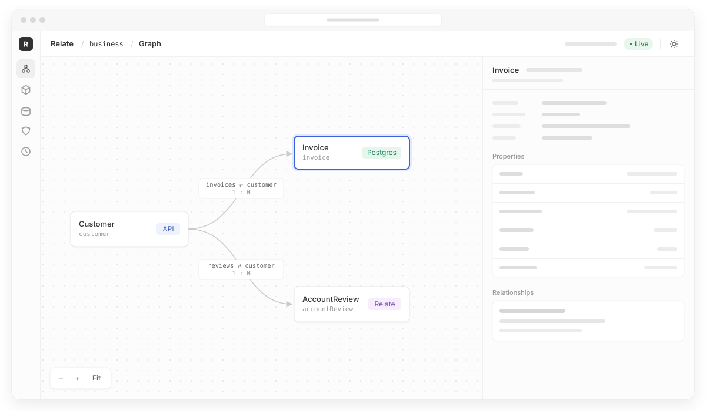

<h1>
  <picture>
    <source media="(prefers-color-scheme: dark)" srcset="assets/brand/relate-logo-dark.svg">
    
  </picture>
</h1>

**A typed, permission-aware model of your business data, defined in
TypeScript.**

Relate lets you describe your business objects (customers, invoices, reviews),
where each field comes from, how the objects relate and who may see what. Your
application, and eventually your agents, then read across your CRM, billing
database and other systems through one typed API. Every read is filtered for the
caller and says where each value came from and how fresh it is.

> **Request for comment.** Relate is early (`0.0.0-dev.0`), not yet on npm and
> not ready for production. We're publishing it now to get the model right in
> the open. [What works today](#status) ·
> [What we'd like feedback on](#feedback)

<p align="center">
  
</p>

## Try it in two minutes

You need **Node 22 (22.16+), 24 or 26** and pnpm 12 (`npm i -g pnpm@12.9.1`). No
database, Docker or credentials.

```sh
git clone https://github.com/relatehq/relate && cd relate
pnpm install
pnpm example:customer-workspace
```

Preparation runs quietly; add `--verbose` to see build logs. Build failures and
runtime errors are always shown.

A small app opens in your browser. Its customer comes from an HTTP CRM, its
invoices from a SQLite database and its account reviews from Relate itself.

1. As **Ana**, an account manager, you see Northwind's invoices but the amounts
   are withheld. The model says only finance sees them.
2. Switch to **Fin** in finance. The amounts appear.
3. As Ana, add a review, then click **Retry last submission**. You get the same
   receipt back and no duplicate review.
4. Rename the customer in the CRM and click **Refresh from sources**.
5. Open **Inspect model** to see the graph. It redraws when you edit
   `src/graph.ts`.

Expand **See what Relate did** to see the exact SDK calls and the evidence
returned with each read.

## Why

Most real work touches more than one system. Before anyone can review an
account, the CRM's customer has to be joined to the billing database's invoices.
Then the code has to check that the caller may see them, judge whether the data
is fresh enough to act on and make a retried submission safe.

Usually each app and each agent integration solves this again in its own glue
code. Relate moves it into one model that every consumer shares. That matters
more once agents are involved: an agent should see what the user asking it may
see, and know whether a number is current.

We built the first version inside [ARC](https://viablesystems.ai), where Viable
Systems deploys agents to do end-to-end work for media businesses. Every client
had a different shape of "customer" spread across different systems. Relate is
that layer, extracted as an open-source library.

## What it looks like

Describe the systems you already have, the objects you want and the rules:

```ts
const access = defineAccess({
  roles: ['employee', 'finance'],
  fieldGroups: ['ordinary', 'financial'],
  claims: { portfolio: z.string() },
});

// Your CRM owns customers.
const crm = defineSource({
  id: 'crm.customers',
  idField: 'id',
  schema: z.object({ id: z.string(), name: z.string(), portfolio: z.string() }),
});

// Your billing database owns invoices. It knows customers by CRM ID.
const billing = defineSource({
  id: 'billing.invoices',
  idField: 'id',
  schema: z.object({
    id: z.string(),
    crm_customer_id: z.string(),
    status: z.string(),
    total: z.number(),
  }),
});

const Customer = defineObject({
  id: 'customer',
  membership: source(crm),
  properties: {
    id: objectId({ id: 'customer.id' }),
    name: from(crm.fields.name, { id: 'customer.name' }),
    portfolio: from(crm.fields.portfolio, { id: 'customer.portfolio' }),
  },
});

const Invoice = defineObject({
  id: 'invoice',
  membership: source(billing),
  properties: {
    id: objectId({ id: 'invoice.id' }),
    customer: reference(Customer, {
      id: 'invoice.customer',
      from: billing.fields.crm_customer_id, // CRM ID → Customer
    }),
    status: from(billing.fields.status, { id: 'invoice.status' }),
    total: from(billing.fields.total, {
      id: 'invoice.total',
      access: access.groups.financial,
    }),
  },
});

const CustomerInvoices = defineRelationship({
  id: 'customer.invoices',
  forward: 'invoices',
  reverse: 'customer',
  via: Invoice.properties.customer,
});

const graph = defineGraph({
  id: 'business',
  objects: { Customer, Invoice },
  relationships: { CustomerInvoices },
  access,
  policies: {
    // Employees see customers in their own portfolio...
    Customer: {
      read: {
        gate: access.role('employee'),
        where: { portfolio: { eq: access.claims.portfolio } },
        evidenceMaxAgeMs: 30_000,
      },
    },
    // ...and those customers' invoices. Only finance sees amounts.
    Invoice: {
      read: {
        gate: access.role('employee'),
        where: { customer: { portfolio: { eq: access.claims.portfolio } } },
        evidenceMaxAgeMs: 30_000,
      },
      groups: { financial: access.role('finance') },
    },
  },
});
```

Then connect the sources and read as an authenticated caller:

```ts
const relate = createRuntime({
  graph,
  connections: [
    connect(crm, {
      connectionId: 'crm',
      providerAccountId: 'acme-crm',
      connector: crmApi,
    }),
    connect(billing, {
      connectionId: 'billing',
      connector: sqlite({ path: './billing.sqlite' }).table('invoices', {
        idColumn: 'id',
        columns: ['crm_customer_id', 'status', 'total'],
      }),
    }),
  ],
});

// Records enter the graph by explicit adoption for now (see Status).
const northwind = await relate.host.adopt(Customer, 'crm_456');
await relate.host.adopt(Invoice, 'INV-1042');

// Your app authenticates the caller. Relate enforces the model's rules.
const { objects } = relate.as({
  id: 'ana',
  roles: ['employee'],
  claims: { portfolio: 'north' },
});

const invoices = await objects.Customer.traverse.invoices(northwind, {
  select: ['status', 'total'],
});
```

Ana gets the status. Compact evidence keeps the explanation for the withheld
amount. Each record in the page looks like this:

```json
{
  "id": "invoice-uuid",
  "data": { "status": "Overdue" },
  "meta": {
    "evidence": "compact",
    "completeness": "partial",
    "degraded": false,
    "definitionRevision": "sha256:…",
    "fields": { "total": { "status": "forbidden" } }
  }
}
```

Pass `evidence: 'full'` to include every selected field's provenance and
freshness details.

A customer outside Ana's portfolio returns `not-found`, the same as one that
doesn't exist.

## What's different

- **Access rules live in the model.** Role gates, claim-based row filters
  (including through references, such as "invoices of customers in my
  portfolio") and field groups are declared once. They are enforced on every
  read, traversal and action, so no consumer can forget to check.
- **Every value has evidence.** Compact responses preserve exceptional field
  states; full responses report provenance and freshness for every selected
  field. Policy checks can demand evidence no older than a set age.
- **Writes are actions with receipts.** Typed, authorized actions run in a
  transaction. They return a receipt for success or for a declared business
  failure, and retrying with the same idempotency key replays the receipt rather
  than repeating the write.
- **Source systems stay in charge.** Relate keeps the identities and
  observations it needs. It doesn't copy your CRM into a new silo.

## Querying the graph

Use `query()` to enumerate records, or add equality filters to find matches:

```ts
const page = await objects.Invoice.query({
  where: { status: 'Overdue' },
  select: ['status', 'total'],
  limit: 100,
});

// No filter enumerates the caller's accessible invoices.
for await (const invoice of objects.Invoice.query()) {
  console.log(invoice.id, invoice.data);
}
```

`await` returns one page; `for await` walks every page. `limit` is the page
size. Multiple filters mean AND, and reference filters use Relate object IDs.
Queries apply the same access rules and field evidence as individual reads,
including inside actions. There is no separate `list` method.

**Queries currently cover records already in the graph:** adopted source records
and Relate-owned records. “All overdue invoices” means all matching invoices in
that graph, not every invoice in your billing system. **Direct source queries
and sync from sources are coming; neither is implemented yet.** For now, your
application discovers source records and adopts them by ID. Comparisons such as
`dueDate < today`, sorting and aggregates are also outside this first query API.

## Many-to-many relationships

Expose direct collections over an explicit junction object:

```ts
const PlaylistSongs = defineRelationship({
  id: 'playlist.songs',
  forward: 'songs',
  reverse: 'playlists',
  through: {
    from: Membership.properties.playlist,
    to: Membership.properties.song,
  },
});

// After registering the objects, relationship, and read policies:
await objects.Playlist.traverse.songs(playlistId, { select: ['title'] });
await objects.Song.traverse.playlists(songId, { select: ['name'] });
```

Both references belong to the same registered junction object. Both directions
return paginated, distinct destinations; junction metadata remains queryable on
`Membership`. Traversal enforces access to the root, membership, both
references, and destination. Source-backed and native junctions are supported.
This adds read traversal; writes remain with the junction's owning system.

See
[many-to-many modeling](apps/docs/content/authoring/graph.md#many-to-many-relationships)
and
[traversal behavior](apps/docs/content/runtime/reading-data.md#many-to-many-traversal)
for complete declarations, ordering, access rules, and bounded-scan pagination.

## Status

| Works today                                             | Not yet                                           |
| ------------------------------------------------------- | ------------------------------------------------- |
| TypeScript authoring, compiler and diagnostics          | Direct source queries and sync from sources       |
| Objects backed by one source; references across sources | One object enriched from several sources          |
| Graph queries with equality filters                     | Comparison filters, sorting and aggregates        |
| Two-way relationship traversal                          | **MCP and HTTP interfaces** (designed, not built) |
| Role gates, claim filters, field-level access           | Writing back to source systems                    |
| Per-field evidence and freshness bounds                 | Migrating between model revisions                 |
| Relate-owned objects, idempotent actions and receipts   | Published npm packages                            |
| In-memory and Postgres stores                           | Work lineage graph of agent reads and actions     |
| SQLite, Stripe and Salesforce (read-only) connectors    |                                                   |
| `relate dev` model inspector                            |                                                   |

Relate runs embedded in a Node application today. Agent access through MCP is
the next major piece. The intended shape is `get`, `query` and `traverse` tools
per object plus one tool per action, all scoped to the authenticated caller. It
isn't built yet.

After that comes work lineage: a graph of how an agent's work unfolded, linking
each object it read, each traversal it followed and each action it took, so you
can see what it looked at and why it did what it did.

## Compact evidence

Reads, queries and traversals return compact evidence by default. Pass
`evidence: 'full'` in the read options to inspect every selected field's
provenance. Both modes preserve values, authorization, completeness, degradation
and the definition revision. Compact responses retain exceptional field evidence
and nonempty warnings; `meta.fields` and `meta.warnings` may otherwise be
omitted. Full responses always include both, and `meta.evidence` identifies the
returned mode.

See [Read Responses & Evidence](apps/docs/content/reference/read-responses.md)
for the complete reference.

## Feedback

We'd most like to hear about:

1. **The model.** Do sources → objects → relationships → policies match how you
   think about your own domain? What can't you express?
2. **Evidence.** Is per-field provenance and freshness useful in practice, or
   noise? What would you do with it?
3. **Getting records in.** Adoption is explicit today. Would you want sync,
   scanning, change feeds or on-demand fetches?
4. **Agents.** What should an agent see? Is a tool per object the right
   granularity for MCP?
5. **Connectors.** Which systems would you need first?

Please open a [discussion](https://github.com/relatehq/relate/discussions) or an
issue.

## Learn more

- [Docs](https://docs.relatehq.dev): [Why Relate](https://docs.relatehq.dev/),
  [Getting started](https://docs.relatehq.dev/getting-started),
  [Key concepts](https://docs.relatehq.dev/key-concepts)
- [Examples](examples/README.md), in learning order, from the smallest terminal
  hello world to persistent Postgres storage
- [Inspector](packages/cli/README.md): `pnpm relate dev`
- [Contributing](CONTRIBUTING.md) · [Releasing](RELEASING.md)

## License

[Apache 2.0](LICENSE). Created by [Viable Systems](https://viablesystems.ai).
