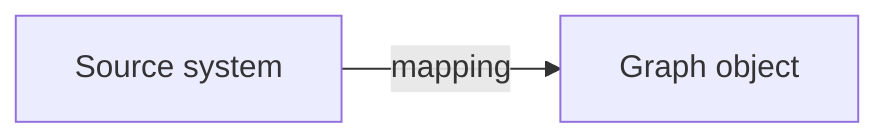

# Docs

A Fumadocs app for the Relate documentation. Pages are Markdown files in
`content/`, listed in `lib/pages.ts`, which drives the routes, sidebar, and page
metadata. Add a page by creating its file and adding an entry there.

From the repository root:

```sh
pnpm docs:dev    # http://localhost:3100
pnpm docs:build  # static site in apps/docs/out
pnpm docs:check  # validation tests, build, registration and generated-link checks
```

Relative links resolve from the Markdown file, as they do on GitHub. Links to
other content files (`../runtime/actions.md`) become site routes; links to any
other repository file open it on GitHub.

CI runs `docs:check` once on Node 26. It rejects unregistered content, missing
registered pages, broken generated links and anchors, and missing repository
targets. External websites and anchors in repository files are not fetched or
validated. Keep learning examples linked to `examples/`; `dev/fixtures` may
contain declaration-only proposals.

Public guides own walkthroughs, the Read Responses page owns the response and
options reference, and package contracts own implementation guarantees. Package
READMEs should summarize their API and link to those guides rather than
duplicate whole tutorials. Keep current-status statements current; migration
history lives in `DEVELOPMENT_NOTES.md`.

The app uses Fumadocs' default neutral theme, layouts, and Markdown components.
Dev and build commands copy the logos and favicon from `assets/brand` into the
generated public folder.

Run `pnpm --filter @relate/docs typecheck` to check the app's types.

Write diagrams in fenced `mermaid` blocks. The site renders them as SVG at build
time using `beautiful-mermaid`, with colors that follow the site theme and an
expandable source view. The same fences render as diagrams on GitHub. Invalid
diagrams fail the docs build.

````md

````

## Generated API reference preview

The API Reference sidebar section contains four selected public exports from
`relate`: `defineSource`, `ObjectId`, `ReadOptions`, and `QueryOptions`, plus an
index. TypeDoc and `typedoc-plugin-markdown` generate ordinary Markdown,
rendered with the same Fumadocs components and theme as the handwritten guides.

Edit the `selected` allowlist in `scripts/generate-reference.mjs` to change the
subset. Missing exports fail generation. Edit API descriptions and examples in
source `/** ... */` comments, then run:

```sh
pnpm --filter @relate/docs reference:generate
```

Generation reads TypeScript source directly (including protocol types), so no
package build is needed. It also runs before docs dev, build, and typecheck.
During a running dev server, rerun the command after editing API comments or
changing the allowlist. Generated Markdown in `content/reference/api/` and its
page manifest in `lib/generated-reference.json` are committed so the preview is
reviewable; do not edit them by hand. Regeneration replaces only that generated
directory. The existing docs checker validates their registration, links, and
anchors too.

This is a filtered preview, not a complete API reference. Types outside the
allowlist remain plain type names; source signatures can expose detailed
TypeScript generics. The handwritten guides and response reference continue to
provide the broader behavioral explanations.
