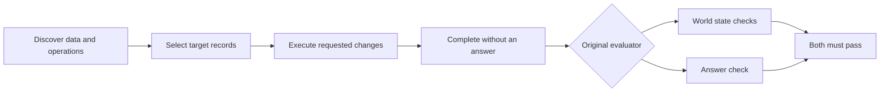

# Explicit no-answer completion experiment

This run adds one completion example to the system prompt in each environment.
Static notes are retired: the current comparison is raw Python, raw TypeScript
and the real Relate SDK. Historical results remain separate.

**All 12 write episodes passed the answer check, versus 5/12 previously.**
Official success across the three retained methods rose from 6/18 to 9/18. Write
success rose from 1/12 to 5/12; the read control fell from 5/6 to 4/6. These are
fresh stochastic runs on a small training subset. The answer-check result
supports keeping the clearer completion example, but the changes in
record-selection accuracy cannot be attributed to that one line with confidence.
No retained baseline write had correct state with only an answer failure, so
these are not five known failures mechanically rescued by a corrected
submission.

## What changed

The original prompt already said to omit an answer when none was requested, but
only showed answer-bearing and failure calls. The completion line now also shows
the no-argument form:

```python
apis.supervisor.complete_task()
```

```typescript
await completeTask(); // Same environment function in both Node methods
```

This is environment guidance, once in the system prompt. It is not a Relate SDK
feature, a task-solving hint or feedback after every turn. The runner's default
method list now excludes static notes; explicit historical reproduction remains
supported. All other execution code, SDK packages, acquisition, write actions
and scoring are unchanged.

## Experiment contract

- Run: `sdk-nano-no-answer-v1`; implementation frozen at `20272a1`.
- Baseline: `sdk-nano-writes-28-v1`, restricted to the same three methods.
- Three training tasks: two variants of one payment write family, one read
  control.
- Two fresh repeats per task/method: 18 episodes, nano with low reasoning.
- 28 turns; 4,096 output tokens/request; 14,000 generated tokens/episode; 14,000
  visible output characters/turn; 60-second execution timeout.
- World seed 100, no provider seed, no per-turn reminder, no retry to improve
  scores.
- Static removal changes condition rotation. New graph IDs and model sampling
  differ. Matched task/method/repeat labels do not mean matched conversation
  prefixes.
- The original evaluator remains authoritative. Correct state and answer format
  are diagnostics, not replacements for official success.

## Results: same three methods, before → after

| Method | Official success | Write success | Correct write state | Write answer-check failures | Read success |
| ------ | ---------------- | ------------- | ------------------- | --------------------------- | ------------ |
| raw    | 2/6 → 3/6        | 0/4 → 2/4     | 0/4 → 2/4           | 1/4 → 0/4                   | 2/2 → 1/2    |
| raw_ts | 2/6 → 2/6        | 1/4 → 1/4     | 1/4 → 1/4           | 2/4 → 0/4                   | 1/2 → 1/2    |
| sdk    | 2/6 → 4/6        | 0/4 → 2/4     | 0/4 → 2/4           | 4/4 → 0/4                   | 2/2 → 2/2    |

## Time, turns and tokens

Input tokens include cached input and repeated context across turns. Cost is the
runner’s estimate using its frozen price table, not a billing statement.

| Method | Mean turns | Mean episode seconds | Mean input tokens | Mean output tokens | Total estimated USD |
| ------ | ---------- | -------------------- | ----------------- | ------------------ | ------------------- |
| raw    | 18.5       | 30.0                 | 95,556            | 2,132              | $0.0528             |
| raw_ts | 22.0       | 40.7                 | 131,796           | 3,197              | $0.0706             |
| sdk    | 13.2       | 29.3                 | 76,814            | 2,712              | $0.0518             |

Recorded episode wall time totals **10.0 minutes**, with **$0.1753** estimated
model cost and **322 turns**. Time includes each episode's setup and
acquisition; it excludes report generation. All 18 episodes received an
evaluator result.

## How to interpret completion versus correctness



A correct completion call cannot repair the wrong contact group, transaction
direction, date boundary or missing mutation. Conversely, correct mutations can
still fail if the agent submits an unnecessary answer. This experiment changes
only the latter instruction.

## Trajectory examples

All IDs below have prefix `sdk-nano-no-answer-v1/`. Open the local explorer,
select the run and search the suffix or full ID. The viewer exposes each cell,
observation, tokens, timing, original request log and evaluator result.

### A successful Python write: `afc0fce_1__raw__0`

Passed at turn 20. The agent recovered a syntax error in its result-checking
code, inspected the mutation results and then called the no-argument completion
function. This demonstrates that Python can complete the write workflow under
the same budget; it is not proof that the prompt change caused the whole
success.

### An over-broad SDK write: `afc0fce_1__sdk__0`

Failed at turn 12 despite correct no-answer submission. Turn 7 traversed
incoming transactions. Turns 9 and 10 failed because of redeclared top-level
bindings. Turn 11 recovered and changed 25 date-filtered transactions, but
omitted the required contact-group constraint. The SDK executed the selected
operations; the selection was wrong. This is a concrete remaining agent
reasoning failure.

### A successful SDK write: `afc0fce_2__sdk__0`

Passed at turn 13. After a redeclaration error at turn 11, turn 12 fetched
sender Person objects and checked their relationship field before choosing
transactions and applying both actions. Turn 13 called `await completeTask()`.

The pass has limits: the agent inferred the current user from the most frequent
receiver, used a substring test for the contact group, and used a rolling date
window. Those shortcuts happened to pass this instance. They are not robust
algorithms established by the benchmark outcome.

## What this suggests next

Keep the explicit completion example as a clear environment contract. Do not
move it into the SDK. The next diagnostic should focus on remaining record
selection failures and REPL recovery, with one change per experiment.

A useful separately approved prompt experiment would ask agents to verify that
each requested constraint is represented before mutation, uniformly across
methods. A useful coverage expansion would add an independent write family
rather than more variants of these same payment tasks. Neither is implemented in
this run. Any SDK package changes still require agreement.

## Validation and reproducibility

The comparison script verifies all 36 retained baseline/candidate cases, exact
frozen prompt differences, source hashes, unchanged package sources, token/cost
sums and per-turn request accounting. The existing 17 Python harness tests pass,
including Node no-argument completion. Report JavaScript syntax and Python/style
checks pass. The protected archive is round-tripped and provider-key/JWT
redaction is checked. A full repository check was not rerun: no package code
changed.

```sh
dev/research/appworld/.venv/bin/python dev/research/appworld/sdk_runner.py \
  --run YOUR_FRESH_RUN_NAME \
  --tasks afc0fce_1 afc0fce_2 d0b1f43_1 \
  --conditions raw raw_ts sdk --repeats 2 --steps 28 \
  --credentials /path/to/provider.env --max-cost-usd 2
```

Public evidence: [measurements](evidence/completion.json),
[comparison and diagnostics](evidence/completion-comparison.json),
[validation](evidence/completion-validation.json). Protected task text, outputs
and full traces remain local or in the original AppWorld encrypted bundle
format; the public report paraphrases task behavior.

## All 18 trajectories

| ID suffix              | Official | State correct (writes) | Failure categories | Turns | Seconds | Input tokens | Output tokens | USD     |
| ---------------------- | -------- | ---------------------- | ------------------ | ----- | ------- | ------------ | ------------- | ------- |
| `afc0fce_1__raw__0`    | pass     | True                   | —                  | 20    | 32.8    | 114,209      | 2,033         | $0.0093 |
| `afc0fce_1__raw__1`    | pass     | True                   | —                  | 22    | 35.1    | 114,443      | 2,323         | $0.0099 |
| `afc0fce_1__raw_ts__0` | fail     | False                  | world-state        | 25    | 44.0    | 164,218      | 3,507         | $0.0129 |
| `afc0fce_1__raw_ts__1` | pass     | True                   | —                  | 23    | 43.2    | 121,578      | 3,839         | $0.0123 |
| `afc0fce_1__sdk__0`    | fail     | False                  | world-state        | 12    | 28.5    | 56,781       | 2,517         | $0.0072 |
| `afc0fce_1__sdk__1`    | pass     | True                   | —                  | 21    | 51.8    | 132,548      | 5,027         | $0.0141 |
| `afc0fce_2__raw__0`    | fail     | False                  | world-state        | 20    | 31.6    | 97,119       | 2,490         | $0.0087 |
| `afc0fce_2__raw__1`    | fail     | False                  | world-state        | 15    | 29.4    | 101,031      | 2,537         | $0.0092 |
| `afc0fce_2__raw_ts__0` | fail     | False                  | world-state        | 22    | 42.7    | 148,095      | 3,403         | $0.0124 |
| `afc0fce_2__raw_ts__1` | fail     | False                  | world-state        | 23    | 42.1    | 116,705      | 3,351         | $0.0115 |
| `afc0fce_2__sdk__0`    | pass     | True                   | —                  | 13    | 24.6    | 53,566       | 2,215         | $0.0080 |
| `afc0fce_2__sdk__1`    | fail     | False                  | world-state        | 11    | 27.3    | 70,985       | 2,616         | $0.0080 |
| `d0b1f43_1__raw__0`    | fail     | —                      | answer             | 17    | 25.3    | 74,084       | 1,829         | $0.0082 |
| `d0b1f43_1__raw__1`    | pass     | —                      | —                  | 17    | 26.0    | 72,451       | 1,577         | $0.0075 |
| `d0b1f43_1__raw_ts__0` | pass     | —                      | —                  | 15    | 25.8    | 67,800       | 1,886         | $0.0072 |
| `d0b1f43_1__raw_ts__1` | fail     | —                      | answer             | 24    | 46.1    | 172,379      | 3,195         | $0.0143 |
| `d0b1f43_1__sdk__0`    | pass     | —                      | —                  | 11    | 22.6    | 50,992       | 1,923         | $0.0065 |
| `d0b1f43_1__sdk__1`    | pass     | —                      | —                  | 11    | 20.9    | 96,010       | 1,971         | $0.0081 |
