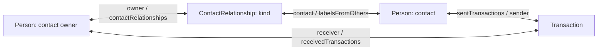

# Explicit contact graph experiment

This experiment changes only the research-authored graph and the mapping of
already acquired data into that graph. It tests whether explicit contact
relationships help agents select the right transactions. System prompts, SDK
packages, REPL, completion instructions, write actions and scoring are
unchanged.

**SDK accuracy is unchanged: 4/6 overall and 2/4 writes.** Both coworker writes
now pass, but both friend writes fail. All four successful SDK episodes use the
new contact-relationship surface; both failed ones ignore it. This is useful
behavioral evidence, not an established accuracy improvement.

SDK mean turns increased from 13.2 to 15.7, mean input tokens from 76,814 to
113,736, and mean episode time from 29.3 to 34.2 seconds. Redeclaration-error
turns increased from 14 to 24 across its six episodes. There is no measured
performance win in this small run. The unchanged controls also moved: raw Python
3/6 → 4/6; raw TypeScript 2/6 → 1/6. Total success stays 9/18.

The authorized graph-only experiment is complete. No query operators, REPL
changes, additional prompt guidance or SDK package changes were introduced.

## Implemented graph change

Previously a Person exposed `sourceId` (actually an email address), `name`, and
`relationshipsJson`, a serialized array. The agent had to fetch people, parse
JSON and filter the labels itself.

The local model now exposes:

```typescript
Person: { id, email, name }
ContactRelationship: { id, owner: PersonRef, contact: PersonRef, kind: string }
Transaction: { id, sourceId, sender: PersonRef, receiver: PersonRef, /* unchanged fields */ }
```

One source contact with two labels becomes two ContactRelationship records. The
owner is the supervisor whose phone contacts supplied those labels. Multiple
owners can label the same contact independently; a label is not a global Person
attribute. Exact duplicate owner/contact/kind tuples are deduplicated with a
stable JSON-tuple source key. These provider keys remain internal to
acquisition; SDK properties expose canonical references.



Discovery supplies descriptions of email identity, owner/contact direction,
exact labels, transaction direction, source versus canonical IDs, count meaning,
and source timestamps. Timestamp values are unchanged; the model explicitly
states that no timezone conversion was inferred. It does not add range filters.

The agent can now express a contact query through existing SDK capabilities:

```typescript
// Illustration of implemented graph shape, not a benchmark answer or prompt.
for await (const relationship of relate.objects.ContactRelationship.query({
  where: { owner: ownerId, kind: label },
  select: ['contact'],
})) {
  const person = await relate.objects.ContactRelationship.traverse.contact(
    relationship.id,
    { select: ['email', 'name'] },
  );
  console.log(person);
}
```

No such solving example was added to the prompt. Agents discover the object and
fields through ordinary SDK discovery.

## Data and execution boundaries

`graph_payments()` calls the existing payment acquisition once, then normalizes
its Person labels into relationship records. It adds no API requests and does
not filter by task ID, desired outcome or evaluator data. Transaction rows are
unchanged. Supervisor identity comes from the same public task context already
given to every agent, and ensures an owner Person exists even without payments.
The historical acquisition shape remains available for old wrapper reproduction.

The scoped changes are in `acquire.py`, `sdk-graph.mjs` and the SDK acquisition
call in `sdk_runner.py`. Existing SDK actions are unchanged. No files under
`packages/` or `connectors/` changed. The original APIs remain absent from the
SDK agent environment.

## Frozen protocol

- New run: `sdk-nano-contact-graph-v1`; implementation commit `674b06a`.
- Baseline: `sdk-nano-no-answer-v1`.
- Same three training instances: `afc0fce_1`, `afc0fce_2`, `d0b1f43_1`.
- Raw Python, raw TypeScript and Relate SDK; two repeats each: 18 fresh
  episodes.
- Nano, low reasoning, 28 turns, world seed 100, no provider seed.
- Same 4,096 output tokens/request, 14,000 generated tokens/episode, 14,000
  visible characters/turn, 60-second execution timeout and $2 run cap.
- Exact same initial system and task messages; no per-turn feedback or reruns.
- Same acquisition request counts, verified for each matched case.
- Static notes are retired. Raw methods are unchanged contemporaneous controls.

This is a combined graph-shape and field-description intervention. It cannot
isolate the contribution of any one field. Fresh sampling and graph IDs mean
matched task/method/repeat cases are not matched conversation prefixes.

## Results: previous graph → explicit contact graph

| Method | Official success | Write success | Read success | Write answer failures | Mean turns  |
| ------ | ---------------- | ------------- | ------------ | --------------------- | ----------- |
| raw    | 3/6 → 4/6        | 2/4 → 2/4     | 1/2 → 2/2    | 0/4 → 0/4             | 18.5 → 17.8 |
| raw_ts | 2/6 → 1/6        | 1/4 → 0/4     | 1/2 → 1/2    | 0/4 → 1/4             | 22.0 → 21.8 |
| sdk    | 4/6 → 4/6        | 2/4 → 2/4     | 2/2 → 2/2    | 0/4 → 0/4             | 13.2 → 15.7 |

## New run timing and usage

| Method | Mean seconds | Mean input tokens | Mean output tokens | Estimated total USD |
| ------ | ------------ | ----------------- | ------------------ | ------------------- |
| raw    | 26.8         | 91,600            | 1,796              | $0.0546             |
| raw_ts | 38.2         | 124,512           | 2,862              | $0.0697             |
| sdk    | 34.2         | 113,736           | 3,298              | $0.0650             |

**9.9 minutes** of summed episode wall time, **332 turns**, and **$0.1892**
estimated model cost. Episode time includes setup/acquisition and excludes
report generation. Input tokens include cached and repeatedly submitted context;
cost uses the runner's frozen rates and is not an invoice.

## Concrete trajectories

All suffixes below use prefix `sdk-nano-contact-graph-v1/`. The local explorer
contains exact code, observations, per-turn usage and original evaluator output.

### Coworker write, repeat 0: graph query used successfully

`afc0fce_1__sdk__0` passed at turn 10. Turn 6 discovered ContactRelationship;
turn 7 queried owner-scoped labels; turn 8 queried exact `kind` and restricted
transaction senders using those canonical contact references. Turn 9 performed
the writes, and turn 10 completed without an answer. Its corresponding previous
case omitted the contact-group filter and failed. This is a concrete example of
the proposed model shape being used, not proof of a causal improvement rate.

The agent still used manual date filtering and copied some observed IDs into
code before re-querying the complete label set. A pass does not establish that
all implementation choices were robust.

### Friend write, repeat 0: available relationship data ignored

`afc0fce_2__sdk__0` failed at turn 20. It never queried the new relationship
object. Turn 5 attempted unsupported `$gte`/`$lte` filters and received a named
ReadError. It then scanned transactions, inferred identity from receiver
frequency, and repeatedly hit redeclaration errors. It compared timestamp
strings containing `T` against bounds containing a space, which is not a sound
datetime comparison. Turn 19 mutated 37 selected transactions without checking
the friend label. Completion was correct; exact write-target checks failed.

This shows the limit of the intervention: making a constraint queryable does not
guarantee the model uses it. Range filtering and REPL behavior were left
unchanged as requested.

### Coworker write, repeat 1: correct labels despite execution friction

`afc0fce_1__sdk__1` passed at turn 22. It queried Person.email and eventually
queried owner-scoped ContactRelationship records, selecting the coworker label
before writes. It also guessed field names, confused an awaited page with an
iterable query handle, exceeded the page limit and repeatedly redeclared names.
The graph did not remove those independent SDK-use and REPL mistakes.

### Friend write, repeat 1: relationship object skipped again

`afc0fce_2__sdk__1` failed at turn 12. It inferred the supervisor from the
latest transaction receiver, selected 34 incoming transactions by date, and
never looked up friend relationships. Turn 8 used the wrong action envelope and
got an ActionError; after reading action descriptions it recovered and mutated
the same over-broad set at turn 11. Its completion answer check passed.

## SDK engagement and remaining friction

These are code-text indicators, not counts of successful SDK operations. Inspect
the linked trajectory for execution results.

| SDK case            | Official | Turns mentioning new relationship surface | Redeclaration error turns | Output-truncation turns |
| ------------------- | -------- | ----------------------------------------- | ------------------------- | ----------------------- |
| `afc0fce_1__sdk__0` | pass     | 6, 7, 8                                   | 0                         | 0                       |
| `afc0fce_1__sdk__1` | pass     | 15, 17, 18, 19, 20, 21                    | 8                         | 0                       |
| `afc0fce_2__sdk__0` | fail     | none                                      | 8                         | 1                       |
| `afc0fce_2__sdk__1` | fail     | none                                      | 2                         | 1                       |
| `d0b1f43_1__sdk__0` | pass     | 4, 5, 6, 7, 8, 13                         | 2                         | 0                       |
| `d0b1f43_1__sdk__1` | pass     | 3, 4                                      | 4                         | 0                       |

## Validation and scope

18 Python tests and 11 Node tests passed, including canonical owner/contact
references, multiple labels, owner isolation, query/traversal and discovery. The
original AppWorld write smoke passed: source mutation, read-after-write, receipt
replay and hidden API credentials. The final comparison validates all 36
baseline/candidate episodes, exact initial messages, frozen source hashes,
unchanged package sources, acquisition counts and token/cost/request accounting.
The protected archive is round-tripped and public/local artifacts checked for
credential redaction. Browser checks cover the current score table, filtering
and matched-case navigation. Full repository checks were not rerun because no
package implementation changed.

Python lint passed with the pre-existing TRY004 and BLE001 findings excluded in
acquisition/runner files; new analysis files pass without those exclusions.

```sh
dev/research/appworld/.venv/bin/python dev/research/appworld/sdk_runner.py \
  --run YOUR_FRESH_RUN_NAME \
  --tasks afc0fce_1 afc0fce_2 d0b1f43_1 \
  --conditions raw raw_ts sdk --repeats 2 --steps 28 \
  --credentials /path/to/provider.env --max-cost-usd 2
```

Evidence: [measurements](evidence/graph-shape.json),
[matched comparison](evidence/graph-shape-comparison.json),
[validation](evidence/graph-shape-validation.json). Protected benchmark material
remains local or in the original encrypted AppWorld bundle format. Historical
reports and graph versions are retained separately.

## Every new episode

| ID suffix              | Official | Failure categories  | Turns | Seconds | Input tokens | Output tokens | USD     |
| ---------------------- | -------- | ------------------- | ----- | ------- | ------------ | ------------- | ------- |
| `afc0fce_1__raw__0`    | pass     | —                   | 23    | 39.0    | 129,002      | 2,263         | $0.0108 |
| `afc0fce_1__raw__1`    | pass     | —                   | 21    | 27.6    | 119,579      | 1,895         | $0.0101 |
| `afc0fce_1__raw_ts__0` | fail     | world-state         | 25    | 45.3    | 140,154      | 3,140         | $0.0126 |
| `afc0fce_1__raw_ts__1` | fail     | world-state         | 16    | 29.1    | 70,598       | 1,923         | $0.0076 |
| `afc0fce_1__sdk__0`    | pass     | —                   | 10    | 22.7    | 56,089       | 1,921         | $0.0065 |
| `afc0fce_1__sdk__1`    | pass     | —                   | 22    | 54.8    | 180,308      | 5,959         | $0.0172 |
| `afc0fce_2__raw__0`    | fail     | world-state         | 17    | 24.5    | 96,105       | 1,738         | $0.0096 |
| `afc0fce_2__raw__1`    | fail     | world-state         | 14    | 22.7    | 68,297       | 1,735         | $0.0088 |
| `afc0fce_2__raw_ts__0` | fail     | answer, world-state | 28    | 48.3    | 166,164      | 4,042         | $0.0145 |
| `afc0fce_2__raw_ts__1` | fail     | world-state         | 23    | 47.9    | 169,082      | 4,240         | $0.0156 |
| `afc0fce_2__sdk__0`    | fail     | world-state         | 20    | 44.6    | 192,669      | 4,622         | $0.0161 |
| `afc0fce_2__sdk__1`    | fail     | world-state         | 12    | 22.2    | 99,860       | 2,009         | $0.0082 |
| `d0b1f43_1__raw__0`    | pass     | —                   | 16    | 22.4    | 69,275       | 1,435         | $0.0072 |
| `d0b1f43_1__raw__1`    | pass     | —                   | 16    | 24.3    | 67,340       | 1,713         | $0.0081 |
| `d0b1f43_1__raw_ts__0` | pass     | —                   | 19    | 27.7    | 80,428       | 1,635         | $0.0077 |
| `d0b1f43_1__raw_ts__1` | fail     | answer              | 20    | 31.0    | 120,646      | 2,193         | $0.0117 |
| `d0b1f43_1__sdk__0`    | pass     | —                   | 16    | 28.2    | 77,440       | 2,171         | $0.0077 |
| `d0b1f43_1__sdk__1`    | pass     | —                   | 14    | 32.8    | 76,050       | 3,105         | $0.0093 |
