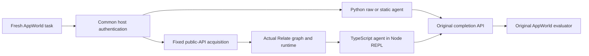

# Nano rerun: current SDK discovery and a one-time completion instruction

> Historical protocol: these recorded SDK episodes included original application
> API access. The current runner now exposes only `relate` and the environment's
> `completeTask` function. A later SDK-only rerun with uniform prompts and a raw
> TypeScript control is recorded in [TS-COMPARISON.md](TS-COMPARISON.md). The
> historical scores below remain unchanged.

This study reruns the three agent conditions using GPT-5.4 nano, the merged
Relate operation contracts and named errors, and an explicit
completion/answer-shape instruction in the system prompt. It adds two tasks
within the existing graph's coverage. No graph, acquisition, REPL, tool
protocol, or scoring behavior was tuned after observing the new results.

The result is exploratory evidence about this agent setup, not a leaderboard
submission or an isolated causal test of the SDK changes. All 36 planned
episodes are retained.

## Results

| Condition | Official success | Completion submitted | Mean turns | Mean wall time | Mean input tokens | Mean output tokens | Total model cost |
| --------- | ---------------- | -------------------- | ---------- | -------------- | ----------------- | ------------------ | ---------------- |
| raw       | 0/12             | 0/12                 | 14.0       | 19.5s          | 26,630            | 1,161              | $0.0601          |
| sdk       | 4/12             | 6/12                 | 12.0       | 20.4s          | 41,246            | 1,388              | $0.0690          |
| static    | 0/12             | 0/12                 | 14.0       | 19.1s          | 28,272            | 1,087              | $0.0580          |

Total recorded episode wall time: **708.1 seconds (11.8 minutes)**. Estimated
model cost: **$0.1870**. Wall time is the sum of sequential episode
measurements, not the time spent building the environment or writing this
report. Costs include reported cached-input discounts; they are not an invoice.

### Results by task

| Task      | Scope                                      | Raw API | Static notes | Relate SDK |
| --------- | ------------------------------------------ | ------- | ------------ | ---------- |
| e7a10f8_1 | Playlist-duration aggregation (existing)   | 0/3     | 0/3          | 1/3        |
| d0b1f43_1 | Outgoing contact-group payments (existing) | 0/3     | 0/3          | 0/3        |
| 82e2fac_1 | Playlist-song popularity selection (added) | 0/3     | 0/3          | 3/3        |
| d0b1f43_2 | Incoming contact-group payments (added)    | 0/3     | 0/3          | 0/3        |

The added payment task reverses transaction direction and changes the contact
group/date constraint within an existing task family. It is not a fourth
independent family. The popularity task introduces a new selection objective
over the already-acquired playlist-song collection. Tasks were selected from
training instructions before running models; solutions were not consulted.

## Exactly what changed

1. Merged main `60f0ff2`, including
   [PR #18](https://github.com/relatehq/relate/pull/18) (`245308f`): SDK-owned
   operation contracts, concrete invocation signatures, reference-filter
   explanations, printable function signatures, and request errors naming
   invalid options and accepted alternatives.
2. Appended this exact instruction once to each condition's system prompt:

> Printing a result does not complete the task. When finished, call the
> completion API described above with your final answer. For numeric questions,
> submit only the numeric value, without explanatory text, currency symbols, or
> units. For questions asking for a name or title, submit only that name or
> title, without explanatory text. Follow any answer-format requirements stated
> in the task.

3. Added two training tasks, retaining the existing two.
4. Used nano for all new episodes. Mini was not substituted after failures.

Completion remains an AppWorld/environment concern. **Nothing was added to the
Relate SDK to teach task completion or answer formatting.** The SDK prompt still
points to generic `describe()` entry points, without embedding this graph's
object names, traversal examples, or task-solving algorithms. Per-turn
completion feedback was disabled.

The only new executable harness behavior is the common prompt addition. The
reporting/export code is separate from agent execution. No package
implementation was edited in this follow-up; the SDK changes came from merged
main.

## Frozen protocol

- Run: `sdk-nano-discovery-v1`; agent source frozen at `49af600`.
- Model: `gpt-5.4-nano`, low reasoning; resolved provider model recorded per
  episode.
- Four tasks × three conditions × three repeats = 36 episodes.
- Conditions: `raw` = original AppWorld APIs in Python; `static` = same plus
  unchanged semantic notes; `sdk` = persistent TypeScript/Node REPL with the
  actual Relate SDK, plus original APIs.
- Maximum 14 turns; 4,096 output tokens per request; 14,000 generated-token
  episode budget; 14,000 visible output characters per turn; 60-second execution
  timeout.
- Same four host authentication calls for every condition. SDK acquisition loads
  the fixed music+payments union for every task. No task-specific acquisition
  routing.
- Original AppWorld evaluator, fresh world per episode, world seed 100,
  counterbalanced condition order, no provider seed.
- Estimated run budget $3. See [the pre-run plan](SDK-RERUN-PLAN.md).



## What the trajectories show

### Nano can complete a narrow SDK query task

The current run scored raw 0/12, static notes 0/12 and SDK-condition 4/12. All
three repeats of playlist-song popularity passed by discovering and querying
Song. This demonstrates a working nano path, not broad task reliability or a
causal graph advantage.

### One of the four SDK-condition passes bypassed Relate

The playlist-duration pass used original Spotify APIs from TypeScript and never
called relate. Three of twelve SDK episodes had no relate. code reference at
all. Separate available tools from actual use when interpreting the condition
score.

### One-time completion instructions are useful, but insufficient

Six SDK episodes marked the task complete: four passed and two submitted
incorrect numeric answers. Six SDK episodes and all 24 Python controls never
completed. One outgoing-payment episode traversed and printed a subtotal on turn
13, then merely printed “submit” on turn 14. Completion remains an environment
instruction, not an SDK feature.

### Turn allocation and interpreter use dominate many failures

A strict syntactic count found 144 of 480 cells containing only a literal status
print. SDK cells had 21 redeclaration errors; Python cells had 40
disallowed-import errors. These diagnostics identify observable waste, not a
causal explanation for every failure. No environment behavior was changed after
seeing them.

### Traversal syntax worked in two episodes; direction still mattered

Two payment episodes executed named traversals successfully. One never submitted
its result; the other traversed transactions received by coworkers instead of
money received by the user, and failed. No successful playlist-through traversal
was observed. No named SDK request error was recorded, so this run does not
measure recovery from the new error hints.

### Successful access is not automatically cheaper overall

SDK episodes averaged 20.4 seconds and 41,246 input tokens, versus 19.5 seconds
and 26,630 input tokens for raw API episodes. SDK setup acquired 57.5 source
calls per episode on average. Many baseline episodes stopped before useful
computation, making efficiency-per-success and causal speed claims
inappropriate.

### Execution errors and SDK use

| Condition | Episodes with execution errors | Recorded error turns | Literal status-print-only cells | Episodes mentioning SDK | Output truncations |
| --------- | ------------------------------ | -------------------- | ------------------------------- | ----------------------- | ------------------ |
| raw       | 12                             | 27                   | 62                              | 0                       | 0                  |
| static    | 11                             | 34                   | 51                              | 0                       | 0                  |
| sdk       | 8                              | 23                   | 31                              | 9                       | 1                  |

These are trace diagnostics, not additional success scores. SDK mentions and
status-only cells are syntactic heuristics. A method appearing in code is not
proof that it executed successfully; a preceding redeclaration error can prevent
the entire cell from executing. Error categories and turn indexes are retained
in [the trace audit](evidence/sdk-nano-trace-audit.json).

## Concrete trajectory examples

### A. A short, successful SDK path

`82e2fac_1__sdk__0` finished in six turns. After two setup/probing cells, it
called graph discovery and Song discovery, iterated the song query with
`for await`, selected a maximum in code, and submitted the selected title. The
evaluator passed it. This is evidence that nano can consume the current SDK's
query/result contract in this environment.

Its substantive computation used this shape (the output title and answer are
omitted):

```ts
let best = null;
for await (const rec of relate.objects.Song.query({
  select: ['title', 'likeCount'],
  limit: 25,
})) {
  if (best === null || rec.data.likeCount > best.likeCount) {
    best = { title: rec.data.title, likeCount: rec.data.likeCount };
  }
}
await apis.supervisor.complete_task({ answer: best.title });
```

This condensed excerpt preserves the approach but combines two recorded cells
and omits logging. It is not a new helper provided to the model.
`82e2fac_1__sdk__1` also passed, in ten turns, despite a redeclaration error and
several status-only cells.

### B. A pass in the SDK condition that did not use the SDK

`e7a10f8_1__sdk__2` passed in twelve turns by discovering original Spotify APIs,
fetching playlists and songs, summing durations in JavaScript, and submitting a
numeric string. No cell called `relate`. It made 37 agent-time source API calls,
in addition to the SDK condition's already-paid acquisition.

This is a valid condition-level success. **It is not evidence of a graph or
traversal advantage.** It also illustrates why the explorer identifies the
condition as available tools and separately reports syntactic SDK use.

### C. An aggregate printed on the final turn, without submission

`d0b1f43_1__sdk__1` discovered Transaction and Person, queried records, resolved
references, filtered the contact group and date, and printed an aggregate on
turn 14. It never called the completion API, so the official result was failure.
Earlier cells included repeated declarations and an overlong transaction dump.
This is a turn-allocation failure that a one-time completion instruction did not
prevent; it does not justify moving completion into Relate.

### D. Correct submission form, wrong computation

`d0b1f43_2__sdk__1` marked the task complete on turn 10 with a bare numeric
string, but the evaluator rejected the answer. Its computation used
`receiver !== meId` on the transaction collection and did not apply the required
contact-group filter. The task required incoming payments, so the submitted
value did not answer the requested question. This failure belongs to task
reasoning/filtering, not answer formatting.

### E. The same environment mistake repeated

`e7a10f8_1__sdk__0` repeatedly reused top-level `const`/`let` names. The REPL
correctly retained the old declarations and rejected the repeated names. Some
attempted API corrections never ran because an earlier declaration in the cell
failed. Python controls showed a different recurring mistake: importing the
injected `apis` object as if it were a Python package. Those errors came from
the existing execution environments, not the newly merged SDK request
diagnostics.

## Performance and acquisition accounting

| Condition | Mean setup seconds | Mean acquisition seconds | Mean total source calls | Mean acquisition calls | Mean agent source calls | Mean cached input tokens | Mean model seconds |
| --------- | ------------------ | ------------------------ | ----------------------- | ---------------------- | ----------------------- | ------------------------ | ------------------ |
| raw       | 0.215              | 0.000                    | 10.1                    | 0.0                    | 6.1                     | 9,845                    | 18.92              |
| sdk       | 0.598              | 0.235                    | 66.4                    | 57.5                   | 4.9                     | 23,541                   | 19.48              |
| static    | 0.101              | 0.000                    | 9.3                     | 0.0                    | 5.3                     | 12,107                   | 18.70              |

A successful short SDK episode may avoid repeated source discovery and fetching
because the host has already acquired the snapshot. That cost is included above,
not erased. Source calls include authentication, acquisition, documentation and
completion calls, while host completion polling is excluded. Agent source calls
exclude authentication and acquisition.

Input tokens sum the full input to each model request, including repeated
history. Cached tokens are a subset of input tokens. Generated tokens include
reasoning tokens. Model time includes network/provider latency; execution time
is separately saved per turn. Small samples, caching and local workload make
timing noisy. We do not claim a causal speedup.

## Comparison with previous runs

| Experiment                      | Model | Raw API | Static notes | SDK | Interpretation                                   |
| ------------------------------- | ----- | ------- | ------------ | --- | ------------------------------------------------ |
| sdk-nano-tool-pilot-v2          | nano  | 0/2     | 0/2          | 0/2 | Earlier SDK and prompt; two tasks, one repeat    |
| sdk-mini-main-v3                | mini  | 0/6     | 0/6          | 2/6 | Earlier SDK and prompt; two tasks, three repeats |
| sdk-mini-completion-feedback-v1 | mini  | 1/2     | 2/2          | 1/2 | Separate post-hoc per-turn reminder experiment   |

For an overlapping-task comparison with the previous nano pilot, restrict this
rerun to `e7a10f8_1` and `d0b1f43_1`:

| Condition | Previous nano pilot | Current nano, overlapping tasks |
| --------- | ------------------- | ------------------------------- |
| raw       | 0/2                 | 0/6                             |
| static    | 0/2                 | 0/6                             |
| sdk       | 0/2                 | 1/6                             |

Do not compare the new four-task aggregate directly with an old two-task
aggregate as an improvement estimate. The SDK version and completion instruction
both changed, the number of repeats differs from the old nano pilot, and model
outputs are stochastic. The earlier mini reminder experiment additionally
changed feedback frequency. None of these comparisons isolates discovery,
answer-format wording, model capability, or traversal's contribution.

## How to inspect an episode

The temporary HTML report includes all 36 new episodes plus 30 scored episodes
from the previous direct-SDK comparisons. Superseded harness pilots are
documented in [SDK-STUDY.md](SDK-STUDY.md), but are not pooled into these
results.

1. Open **Explore traces**, or use an **Explore** button in a results row.
2. Select experiment, condition, outcome and task. Search code and output for
   terms such as `traverse`, `complete_task` or `already been declared`.
3. Select an episode and then a turn. Code appears beside the exact
   model-visible observation, with simulated credentials redacted.
4. Switch the chart between model time, execution time, input/output tokens and
   estimated cost. Each turn also shows cached tokens and source API call
   counts.
5. Expand initial messages, full episode metrics or evaluator results. The
   **Implementation** tab shows that experiment's saved source snapshots with
   line numbers.

The explorer is read-only: it does not execute cells or make model calls. Raw
benchmark instructions, simulated records and answers remain in the local
artifact or AppWorld-encrypted archive; they are not copied into the public
report. Provider encrypted/private reasoning is omitted from the explorer.

## Next tests, not implemented here

- Keep completion and answer-shape rules in the system prompt; do not add
  benchmark completion behavior to Relate.
- If testing the new discovery/error features causally, freeze the prompt and
  run the same model/tasks against old and new SDK revisions. This rerun cannot
  isolate those effects.
- Consider a separate, explicitly labeled REPL ergonomics experiment: teach
  assignment/reuse versus redeclaration once in the environment prompt, or
  compare execution semantics. Do not silently change this run's environment
  after inspecting failures.
- Investigate turn use before increasing token budgets: literal status-only
  cells and unprinted documentation requests can consume an episode without
  solving the task. A changed iteration instruction or a larger turn budget
  would be a separate experiment.
- Expand to held-out development tasks only after freezing the interface and
  protocol. Current tasks were selected for coverage and remain development
  evidence.

## Validation and evidence

The merged packages built successfully. Nine research Node tests, thirteen
research Python tests, eleven focused operation-contract/request-error tests,
and the real AppWorld evaluator-persistence regression passed. Python lint, HTML
JavaScript syntax, focused formatting, and browser checks of the explorer
passed. This is focused validation, not a claim that the full repository-wide
check was run.

All 36 episodes completed evaluation without infrastructure errors. The
archive/source/prompt integrity checks are recorded in
[validation evidence](evidence/sdk-nano-validation.json). The experiment's
model-visible messages contain the shared completion instruction once in the
system message and no per-turn completion reminder. The runner, acquisition,
graph and REPL files remained unchanged throughout the run.

- [Machine-readable measurements](evidence/sdk-nano-rerun.json)
- [Trace audit](evidence/sdk-nano-trace-audit.json)
- [Pre-run plan](SDK-RERUN-PLAN.md)
- [Previous study and diagnostic history](SDK-STUDY.md)
- [AppWorld-encrypted trajectory bundle](evidence/trajectories.bundle)

## Reproduction

Use the recorded revision and the existing AppWorld installation/data described
in [README.md](README.md). The credential file is host-only; only
`OPENAI_API_KEY` is read.

```sh
pnpm build
dev/research/appworld/.venv/bin/python dev/research/appworld/sdk_runner.py \
  --run new-unique-run-name \
  --tasks e7a10f8_1 d0b1f43_1 82e2fac_1 d0b1f43_2 \
  --conditions raw static sdk --repeats 3 --model gpt-5.4-nano \
  --credentials /path/to/authorized.env --max-cost-usd 3
```

Do not add `--completion-feedback`: this study uses a one-time system
instruction. Run names are immutable. Every episode records actual initial
messages, code/output, usage, source calls, original evaluator results and
source hashes. Repeats are not guaranteed deterministic.

To rebuild the local explorer from the retained run directories:

```sh
python3 dev/research/appworld/explorer.py \
  --output /tmp/relate-nano-report \
  --findings dev/research/appworld/evidence/sdk-nano-findings.json
python3 -m http.server 55251 --bind 127.0.0.1 \
  --directory /tmp/relate-nano-report
```
