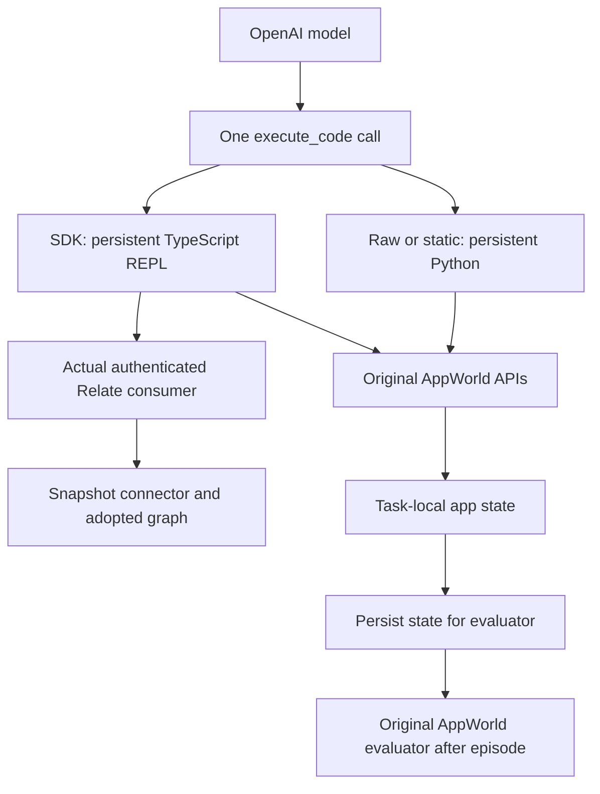
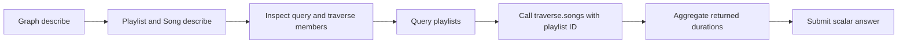

# Direct SDK study

This follow-up replaces the experimental `research()` agent interface with the
current public Relate SDK. The raw and static-note agents retain AppWorld's
persistent Python interpreter. The Relate agent uses a persistent TypeScript
REPL in a separate Node process. It receives the actual authenticated consumer,
not a replacement graph API.

## Initial protocol fixed before the first paid pilot

- SDK baseline: upstream main `1556498`, including query (#13), compact evidence
  (#15), explicit through traversal (#16), and actor-bound discovery (#17).
- Model: `gpt-5.4-nano`, reasoning `none`; use `gpt-5.4-mini` if pilot evidence
  warrants it. Models are always compared within a model, never pooled.
- Tasks: the same two previously studied training cases, `e7a10f8_1` and
  `d0b1f43_1`. They are familiar exploratory cases, not held-out validation.
- Conditions: Python raw APIs; Python APIs plus the original static notes;
  TypeScript original APIs plus the actual Relate consumer.
- Initial pilot: one episode per task/condition. Retain failures and distinguish
  harness repairs from model/SDK findings. Freeze the subsequent main run and
  repeat each task/condition three times with counterbalanced condition order.
- Budgets: 14 turns, 1,600 output tokens per request, 14,000 generated tokens
  per episode, 14,000 visible output characters per cell. Execution timeout is
  60s.
- Responses API, strict JSON code output, no tools, no provider seed, no
  retained server conversation (`store: false`). Repetitions are independent
  attempts, not deterministic seeds. AppWorld's world seed remains 100.
- A $2 estimated-cost ceiling bounds the pilot; a $5 ceiling bounds a main run.
  Cost accounting uses published token rates, including cached input; it is an
  estimate, not an invoice. Each request reserves a conservative input-byte /
  maximum-output bound against the cap.

## What the agent knows

The TS system prompt names `relate.describe()` and
`relate.objects[apiName].describe()`, alongside the original app documentation
entry points. It does not enumerate graph objects, properties, relationships,
query syntax, IDs or task-solving examples. Domain descriptions live on the
hand-authored graph and arrive only when the agent calls discovery. SDK
`describe()` is capability/schema discovery; whether it supplies enough
operation syntax to an unfamiliar model is part of the experiment.

All conditions receive the same task text, supervisor context, simulated date,
and host-authenticated Spotify, Phone and Venmo tokens. TS original API methods
are asynchronous and accept a named-argument object; they dispatch to the exact
same AppWorld API collection used by Python. Their responses and evaluator state
are not mocked. The agent completes through AppWorld's supervisor API.

The TS REPL supports top-level await, persistent declarations and recoverable
syntax/runtime errors. TypeScript syntax is transpiled, not statically checked.
Only printed output is returned. Node permissions deny network, child processes,
workers and reads outside the allowlisted code/dependencies. The host's OpenAI
key, task files, environment files and evaluator are not passed into the child.
The VM context is not itself treated as a security boundary.

## Data and ownership

Python retains the original acquisition and normalization: playlist-library
pages and unique song details; contacts and own transactions joined by exact
email. Every SDK episode acquires the same union of music and payments,
regardless of task ID. Setup is eager and counted, rather than presenting it as
free agent work. No graph schema or identity rule is learned automatically.

Node binds those normalized records through a snapshot connector, adopts them,
and gives the agent `runtime.as(reader)` as `relate`. `query()`, `get()`,
traversal, descriptions and compact evidence execute in public packages.
`Playlist.traverse.songs()` is declared using a `through` relationship over the
existing Membership object. The original membership traversals remain available.
There is no custom list implementation or compact-evidence projection on this
path. Source writes invalidate the snapshot consumer before the TS API promise
resolves; these selected tasks are read-only, so no reload API is introduced.

## Interpretation boundaries

This is a comparison of complete setups. Language, discovery interface,
pre-acquisition, hand-authored semantics and graph execution differ together. A
better score or fewer turns is not a causal estimate of graph structure alone.
Raw/static share Python; their difference is the semantic-note ablation.

Track accuracy and completion separately, turns, summed input/output/cache
tokens, estimated cost, model latency, setup/acquisition time, total episode
wall time, all underlying source calls and agent-time calls. SDK snapshot
fetches are local connector reads, not provider calls. Setup time includes
environment initialization, authentication, source acquisition and Node
adoption.

The AppWorld evaluator runs after the agent exits. Evaluation data is never
returned to the agent. Exact task text, answer-bearing data and traces remain in
ignored `.local/runs/` and the protected AppWorld archive. Public evidence
contains aggregate metrics and sanitized failure categories.

## Reproduce

After the original AppWorld installation instructions in README:

```sh
pnpm install --frozen-lockfile
pnpm build
cd dev/research/appworld
.venv/bin/python sdk_runner.py \
  --run sdk-reproduction \
  --tasks e7a10f8_1 d0b1f43_1 \
  --conditions raw static sdk --repeats 3 \
  --model gpt-5.4-mini --reasoning low \
  --credentials /path/to/local/credentials.env \
  --max-cost-usd 5
```

The credential file must contain `OPENAI_API_KEY`. Only the host reads it; the
path and value are excluded from saved configuration. No cloud fallback exists
in the original Ollama runner. This new runner explicitly uses OpenAI.

## Harness development and retained diagnostics

The initial nano pilot used a 1,600-token per-response cap and no reasoning. It
repeatedly truncated long code generations. The first mini pilot raised the cap
to 4,096 but also exposed two harness defects: response text from multiple
message phases was concatenated, and TS completion calls were not flushed to the
evaluator's normal disk output (a checkpoint alone is insufficient). Both SDK v1
pilot score sets are invalid and excluded from accuracy aggregates.

Before `sdk-mini-pilot-v2`, the harness selected the final-answer message,
preserved that phase in conversation history, flushed SDK state through a no-op
AppWorld execution, and added the same short-cell iteration instruction to all
conditions. The SDK prompt directs graph reads to the actual consumer and starts
at discovery; original APIs remain available for missing capabilities. The model
uses low reasoning and a 4,096-token response cap. No graph schema or method
signature examples were added to the prompt. The persistence regression submits
an arbitrary marker and checks that the original evaluator reads that marker
from disk; it does not supply a solution.

The corrected pilot completed all six episodes. It exposed SDK operation-syntax
and identity confusion, which remain unchanged for the main study. The main
`sdk-mini-main-v1` uses the same prompts, model, low reasoning, response cap and
budgets as v2, with three repetitions per task/condition (18 episodes).
Additional changes before freezing main only classify killed Node cells as
execution failures rather than infrastructure failures, record completion
explicitly, and extract response selection into a tested helper. These cases did
not occur in corrected pilot v2.

## Final protocol: explicit code execution

`sdk-mini-main-v1` is retained as a diagnostic, not the final comparison. During
that run, a response contained multiple commentary-phase proposed cells and a
final inability answer, without an execution boundary between them. Selecting
only the final message discarded the proposed cells. That was a code-action
protocol confound shared by every arm, not evidence of SDK failure.

The final runner uses one strict `execute_code` function tool, forced as the
next action with parallel tool calls disabled. Its argument is `{code: string}`;
it runs Python for raw/static and TS for SDK. It is an interpreter tool, not a
new graph API. Each call gets its actual output before the next model request.
The runner replays provider output items (including message phases and encrypted
reasoning for stateless requests) and attaches a matching
`function_call_output`. No commentary or final-message text is executed as code.
The old system prompt's JSON-output instruction becomes a language-specific
`execute_code` instruction; all other task/domain and iteration instructions
stay the same.

`sdk-mini-tool-pilot-v1` checks that loop, `sdk-nano-tool-pilot-v1` checks nano
on the corrected loop, and `sdk-mini-main-v2` is the final 18-episode
comparison. The first tool pilot also produced a response without a code call.
The runner initially classified that as infrastructure failure and omitted that
response's usage. Before the final run, this was changed to retain the full
response and usage and score the episode as `model-no-action` (unsuccessful if
the task was not completed). The partial `sdk-mini-main-v2` and
`sdk-nano-tool-pilot-v1` runs were stopped during this correction; their
coverage reports retain missing cells. The corrected nano check is
`sdk-nano-tool-pilot-v2`.

Both models use low reasoning, a 4,096-output-token cap and the same task/turn/
output budgets. The mini main run repeats each task/condition three times. No
model-quality ranking is inferred from differently configured earlier pilots.
The final comparison is frozen before it starts; SDK usability failures remain
observations rather than triggers to add task-solving prompt examples.

## Completion-status follow-up

The primary run is not changed after observing its failures. A separate six-cell
`sdk-mini-completion-feedback-v1` ablation uses `--completion-feedback`: after a
cell, every condition receives the same factual incomplete-task status and the
language-appropriate call for submitting an answer. It adds no graph schema,
query/traversal syntax, task solution or semantic guidance. It uses the existing
completion poll, so no extra application API call is introduced. Its six scores
must not be pooled with the primary 18.

## Execution path



The host acquires the snapshot through those same AppWorld APIs before the SDK
agent starts. The `execute_code` tool dispatches a whole code cell; it does not
wrap, rename or reimplement SDK reads. The child gets the actual consumer
object.

## Results

The direct SDK integration works, including current-main discovery, query,
compact evidence and through traversal. The experiment does **not** establish a
general accuracy advantage. Official task success is strongly affected by task
submission, and this is only two familiar training cases repeated three times.

### Frozen mini comparison: 18 episodes

| Condition | Official success | Correct numerical result observed* | Mean turns | Mean input tokens | Mean output tokens | Mean wall seconds | All AppWorld calls / episode |
| --------- | ---------------- | ---------------------------------- | ---------- | ----------------- | ------------------ | ----------------- | ---------------------------- |
| raw       | 0/6              | 3/6                                | 12.7       | 60,243            | 1,464              | 17.2              | 27.7                         |
| static    | 0/6              | 5/6                                | 12.7       | 63,189            | 1,729              | 30.6              | 28.5                         |
| sdk       | 2/6              | 6/6                                | 12.7       | 51,708            | 1,397              | 17.3              | 54.2                         |

\* Manual, post-hoc trace audit of the computed quantity; **not a rescored
benchmark**. It is included to distinguish calculation from submission. Correct
values printed in a cell do not constitute task completion. Official scores are
unchanged. See [sdk-trace-audit.json](evidence/sdk-trace-audit.json).

All six SDK episodes printed the correct quantity. Two music episodes submitted
an accepted answer. Another music episode and one payment episode did not
submit. The other two payment episodes submitted the correct quantity inside a
sentence or with a currency symbol; the payment evaluator expects a numeric
value. Raw agents computed the music quantity correctly but guessed the payment
population. Static notes fixed that population in two of three payment attempts.
This is suggestive evidence about locating relationship semantics, not a broad
graph accuracy estimate.

All AppWorld calls include the four authentication/setup calls and documentation
and completion calls; host completion polling is excluded. SDK acquisition
contributes 40 calls on the music case and 57 on the payment case because every
SDK episode preloads both domains. Mean agent-time calls are 23.7 raw, 24.5
static and 1.7 SDK. Quoting only that last number would hide the
eager-acquisition cost. SDK setup averaged 0.59s, of which acquisition took
0.24s in the local simulator. The snapshot connector's later fetches are local
reads, not provider requests.

The 18 primary episode durations sum to **391.0s (6.52 minutes)**. Estimated
model cost was **$0.4092**. Input-token means count repeated context on every
request; output tokens include reasoning tokens. Cached input is recorded
separately in the evidence. Cloud latency, caching and concurrent local
validation make these descriptive timings, not a causal speedup measurement. No
primary visible output was truncated.

### Same completion reminder for every condition: six exploratory episodes

| Condition | Official success | Mean turns | Mean wall seconds | Estimated model cost, both episodes |
| --------- | ---------------- | ---------- | ----------------- | ----------------------------------- |
| raw       | 1/2              | 10.5       | 18.5              | $0.0504                             |
| static    | 2/2              | 10.5       | 15.0              | $0.0456                             |
| sdk       | 1/2              | 12.5       | 14.9              | $0.0622                             |

The generic completion-status reminder increased task submission in this small
follow-up. Raw passed music and failed payment; static passed both; SDK passed
payment and exhausted its turn budget on music. The SDK payment success queried
people in Relate, then used original Venmo APIs for the sum. It is a success for
the combined setup, not evidence of a successful graph traversal.

This follow-up was selected after examining primary failures. It changes a
shared execution instruction, does not isolate graph effects, and is not pooled
with the primary run. The earlier JSON-message experiments and interrupted tool
pilots are retained in [sdk-diagnostics.json](evidence/sdk-diagnostics.json),
with explicit coverage and invalid-score exclusions.

### Nano on the corrected tool loop

Nano completed all six episodes and passed none (0/2 in each condition),
reaching the 14-turn budget each time. This used the same low reasoning and
4,096-token per-response budget as mini. Its small sample does not establish a
general model ranking. The earlier nano truncation pilot had a different
budget/protocol and must not be used as evidence that nano cannot execute these
tasks.

### SDK behavior actually observed

All six primary SDK episodes used discovery and query. **Only one successfully
used direct through traversal.** Two other music attempts tried an incorrect
traversal shape, then joined Membership and Song query results in TypeScript. A
correct query-based aggregate is useful, but it does not validate the agent's
ability to find and use the new traversal API.

The successful through-traversal episode took this route:



A different episode found the same objects but assumed traversal belonged to the
returned record or a query builder. These are sanitized call-shape examples from
the failures; identifiers and benchmark records are omitted:

```ts
// Failed: traverse is an object containing named functions.
await relate.objects.Playlist.traverse(playlistId, 'songs');

// Failed: songs is the traversal function, not a nested query builder.
relate.objects.Playlist.traverse.songs.query;

// Current SDK:
const page = await relate.objects.Playlist.traverse.songs(playlistId, {
  select: ['duration'],
});
```

The agent also guessed AppWorld-style paging names:

```ts
// Failed with ReadError('invalid-request'):
await relate.objects.Person.query({ pageSize: 10, pageIndex: 0 });

// Current SDK:
const page = await relate.objects.Person.query({ limit: 10 });
// When !page.meta.exhausted:
await relate.objects.Person.query({
  limit: 10,
  cursor: page.meta.continuationCursor,
});
```

Calling `.toString()` on SDK methods exposed closure implementation text, not a
usable operation reference. `describe()` supplied object properties, reference
targets and traversal names, but no parameter or return-shape schema. The agent
had to infer those from calls and errors. Four of six primary SDK episodes had
at least one runtime/syntax error. Several were normal Node
lexical-redeclaration errors, which are an execution-language cost rather than a
Relate defect.

## What to improve next

1. **Make operation contracts discoverable through the SDK itself.** Keep graph
   discovery, but add generic call signatures, option schemas, result shapes and
   pagination/async-iteration instructions. A traversal descriptor should make
   the existing path `objects.<Type>.traverse.<name>(id, options)` evident.
   Query documentation should explain equality filters, `limit`, input `cursor`,
   output `meta.continuationCursor`, and graph-membership scope. This should be
   SDK-owned documentation, not a new `research()` method or task-specific
   prompt tutorial. Validate an unfamiliar model learning the operations solely
   from discovery before running more task cases.
2. **Give useful argument errors.** The observed `ReadError: invalid-request`
   does not identify the wrong paging option. Explain which option is invalid
   and the accepted generic option names, without exposing inaccessible fields
   or records. Keep canonical reference typing; explain its use in query filters
   in the discovered operation contract.
3. **Treat completion and answer shape as explicit environment feedback.** The
   same status reminder helped raw and static conditions too. Future experiments
   should freeze this shared protocol before comparing SDK changes and return
   the submission API's scalar-answer contract. Do not silently normalize
   answers in the evaluator or count printed calculations as official passes.
4. **Separate language ergonomics from SDK effects.** The current REPL
   transpiles TS but does not typecheck cells or provide editor completions.
   Test type/error feedback or minimal variable-reuse guidance as a separate
   ablation. Do not replace the requested Python baseline with TS to conceal
   this difference.
5. **Measure useful provider work, not just agent calls.** Query currently scans
   adopted graph members. The SDK's two-domain eager load increases source work.
   A later connector/query experiment should preserve source coverage evidence
   while acquiring only needed domains or pushing supported predicates to the
   provider. Keep its results separate from an interface-only change.
6. **Expand cases only after fixing the measured contract gaps.** Use additional
   training/development cases within declared coverage, then freeze a held-out
   set. Add source-denial/staleness and pagination cases. The present two tasks,
   their repeats and post-hoc prompts cannot support general uplift claims.

No production package was modified for this follow-up. Query, compact evidence,
through traversal and discovery came from main. New code is the research host,
TS REPL, snapshot authoring, model loop, metrics and regression checks.

## Evidence and validation

- [sdk-summary.json](evidence/sdk-summary.json): every primary, corrected-nano
  and completion-follow-up episode, source hashes, budgets, means and coverage.
- [sdk-diagnostics.json](evidence/sdk-diagnostics.json): all superseded pilots,
  incomplete run coverage and exclusions. Interrupted in-flight requests and the
  terminal no-action response before accounting was fixed are not fully
  represented in old cost totals; those totals are not a project invoice.
- [sdk-trace-audit.json](evidence/sdk-trace-audit.json): manual numerical-result
  / submission audit, distinct from official accuracy.
- Full traces, provider output messages, initial prompts and source snapshots
  are in the protected AppWorld archive; no raw task answers or records are
  published.
- Research tests: 9 Node tests, 13 Python tests, plus the live AppWorld
  persistence regression. Root typecheck, lint, formatting and package
  boundaries passed; 683 unit tests, 190 integration tests and installed-package
  smoke checks passed.

Published token prices used in the estimates:
[GPT-5.4 mini](https://developers.openai.com/api/docs/models/gpt-5.4-mini) and
[GPT-5.4 nano](https://developers.openai.com/api/docs/models/gpt-5.4-nano). The
code loop follows the explicit function-call/output lifecycle in the
[OpenAI function-calling documentation](https://developers.openai.com/api/docs/guides/function-calling).
