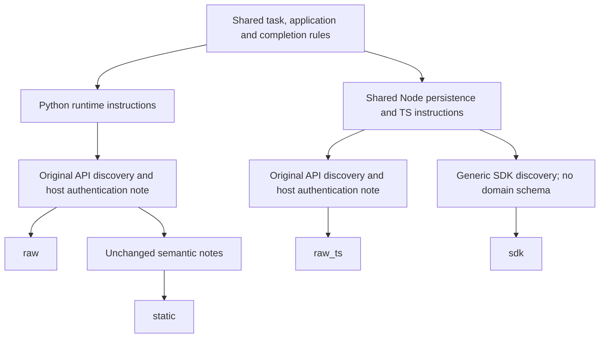
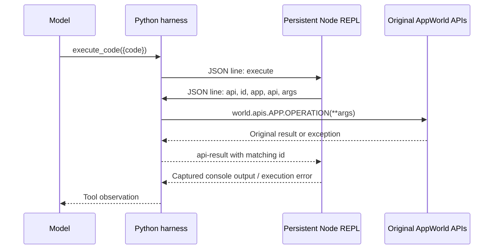
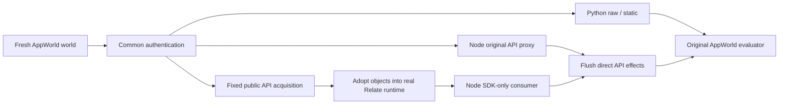
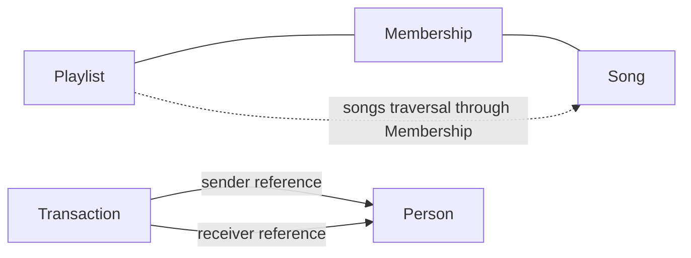

# Uniform prompts and an original-API TypeScript control

The new run compares original AppWorld APIs in Python and TypeScript with the
actual Relate SDK in TypeScript, plus the existing Python static-notes ablation.
All **72 planned episodes** are retained: six training instances, four
conditions and three repeats. Nano was used throughout. The SDK condition has
**no original API access**.

| Condition               | Official success | Marked complete | Mean turns | Mean wall time | Mean input tokens | Mean output tokens | Total model cost |
| ----------------------- | ---------------- | --------------- | ---------- | -------------- | ----------------- | ------------------ | ---------------- |
| Raw APIs / Python       | 1/18 (5.6%)      | 1/18            | 13.9       | 20.9s          | 54,370            | 1,322              | $0.1134          |
| Static notes / Python   | 6/18 (33.3%)     | 7/18            | 13.4       | 20.6s          | 53,982            | 1,335              | $0.1158          |
| Raw APIs / TypeScript   | 3/18 (16.7%)     | 6/18            | 13.4       | 22.7s          | 56,403            | 1,592              | $0.1236          |
| Relate SDK / TypeScript | 13/18 (72.2%)    | 17/18           | 8.2        | 15.1s          | 30,991            | 1,108              | $0.0833          |

Total recorded episode wall time: **1427.2 seconds (23.8 minutes)**. Estimated
model cost: **$0.4361**. These are sequential episode measurements, not
development/reporting time. Costs use recorded provider token usage and the
manifest's cached-input rates, not an invoice.

The central comparison is **raw TS versus SDK TS**: same model, task worlds,
prompt rules, Node interpreter, transpilation and completion helper. This
removes the Python-versus-Node difference from that comparison. It still
compares an on-demand original API against a pre-acquired, normalized,
semantically modeled graph; it does not isolate traversal or the SDK syntax
alone.

## Results by task

| Task ID     | Task scope                                 | Raw Python | Static Python | Raw TS | SDK TS |
| ----------- | ------------------------------------------ | ---------- | ------------- | ------ | ------ |
| `e7a10f8_1` | Longest playlist duration                  | 1/3        | 1/3           | 2/3    | 3/3    |
| `d0b1f43_1` | Outgoing roommate payments                 | 0/3        | 0/3           | 0/3    | 3/3    |
| `82e2fac_1` | Playlist-song public popularity            | 0/3        | 2/3           | 0/3    | 3/3    |
| `d0b1f43_2` | Incoming coworker payments                 | 0/3        | 0/3           | 0/3    | 0/3    |
| `e7a10f8_2` | Shortest playlist duration (added)         | 0/3        | 3/3           | 0/3    | 3/3    |
| `d0b1f43_3` | Sent-or-received roommate payments (added) | 0/3        | 0/3           | 1/3    | 1/3    |

The two additions were selected by training instructions before execution;
solutions were not consulted. They reverse playlist aggregation (shortest
instead of longest) and broaden payment direction (sent or received). These are
**six instances spanning three task families**, not six independent families.
All are within the existing graph coverage; acquisition and modeling did not
change. Repeats share the underlying task data; model sampling and regenerated
graph identities can vary execution. They do not supply new independent data.

## Main findings

### The SDK advantage survives the shared-Node comparison

SDK-only passed 13/18 versus original APIs in TypeScript 3/18, a 55.6
percentage-point success-rate difference on this sample. Both use the same Node
REPL and common prompt rules. Language alone does not explain this gap; the
intervention still includes pre-acquisition, normalized collections and authored
semantics.

### Static notes remain a useful separate ablation

Python with notes passed 6/18; raw Python passed 1/18. Notes provide
interpretation guidance without a graph or pre-acquired records. The practical
comparison remains original APIs versus the Relate system; these exploratory
counts do not establish a general ranking across languages or tasks.

### Successful paths include both traversal and ordinary queries

The longest-playlist SDK repeat 0 passed in six turns using
Playlist.traverse.songs; its raw-TS counterpart took twelve. The
outgoing-payment SDK repeat 0 passed using Person and Transaction queries and
canonical references, without named traversal. Do not attribute every SDK pass
to relationship navigation.

### The SDK still permits wrong interpretation and incorrect submission

The bidirectional-payment SDK repeat 0 subtracted incoming and outgoing amounts
instead of totaling them. Incoming-payment repeat 1 filtered the coworker
receiver rather than sender. Both submitted and failed. Incoming-payment repeat
0 also confused an awaited query page with an iterable handle and exhausted the
turn budget.

### Status-only cells and execution errors still consume turns

The strict audit found 198 of 882 cells consisting only of a literal status
print. Raw TS recorded 17 redeclaration errors and 9 authorization errors; SDK
recorded 10 redeclaration errors. These are observed symptoms, not a causal
attribution. Exact per-episode diagnostics accompany the report.

### Count acquisition and accuracy alongside speed

SDK episodes averaged 15.1s and 30,991 input tokens, versus raw TS 22.7s and
56,403. SDK acquisition averaged 56.8 original API calls before the first agent
turn. The dataset is preloaded locally; this is not a production-service latency
or acquisition-reuse benchmark.

### One episode recovered from a named SDK request error

Outgoing-payment SDK repeat 2 requested limit: 1000 and received a ReadError
identifying limit and the accepted range 1–100. It changed the limit to 100,
recovered from subsequent REPL redeclaration errors, and passed in 11 turns.
This is an observed recovery, not an isolated causal test of the new error
design.

### Next: same acquired data, plain TypeScript arrays

Keep raw TS as the practical baseline. Add a flat-snapshot TS arm with the same
acquired rows and scope semantics as the SDK. That separates the value of
preparation and modeling from SDK query/traversal ergonomics. Then expand
independent task families; this run contains six training instances across only
three families.

## What changed, and what stayed fixed

1. Replaced the earlier custom prompt with a shared, zero-shot adaptation of
   AppWorld's ReAct-code instructions. The same task rules and completion/answer
   contract appear once in every system prompt.
2. Added `raw_ts`: original AppWorld APIs called from the persistent Node REPL.
   It receives the original API documentation, tokens and JSON responses, with
   no Relate graph, normalization or pre-acquisition.
3. Exposed identical `completeTask({answer, status})` capabilities in both Node
   arms and flushed their direct API effects to AppWorld's evaluator input.
4. Added the two task variants and reran all four conditions three times.
5. Extended the report and local explorer with the fourth condition, six task
   filters, current source snapshots and searchable trajectory IDs.

No Relate package source changed in this iteration. The SDK still uses merged
main `60f0ff2`, including the operation contracts and named errors from PR #18.
Compact evidence, explicit traversal and SDK discovery are existing package
features here, not new interventions. The graph model, acquisition, static
notes, model tool protocol, evaluator and budgets were not tuned during this
run. Completion guidance remains in the environment prompt, not the SDK.

### Prompt fidelity and remaining differences

Read [PROMPT-PROVENANCE.md](PROMPT-PROVENANCE.md) for the pinned upstream
commit, source hash and exact adaptations. `prompts.py` is the current source,
and each run archives both the source and exact per-condition prompts.

All arms preserve these upstream concepts: autonomous completion, retrieving
actual values, no invented placeholders, avoiding unrelated actions, finding
relationship labels in phone contacts, simulator time, simulated file access,
reading operation documentation, pagination, and submitting only the requested
answer. The old login contradiction and “one short cell” ending are removed. The
supplied API object is explicitly an existing object, not a module to import.

This is **not the untouched upstream benchmark agent**. We omit its worked
playlist/login demonstration in all arms, retain the existing single-tool-call
protocol and host authentication, and use a system message. The SDK prompt
contains generic discovery entry points only; it does not name this graph's
objects, fields, relationships or solving strategy. Static notes remain the one
intentional extra semantic prompt. Python and Node syntax/printing still differ;
the shared Node comparison controls that difference.



## How the original APIs work in TypeScript

The agent receives `apis`, a nested asynchronous JavaScript proxy. App and
operation names, named arguments and response fields remain the benchmark's.
Python keyword arguments become a JS object and calls are awaited:

```python
# Original Python control
print(apis.api_docs.show_api_doc(
    app_name='spotify', api_name='show_playlist_library'))
page = apis.spotify.show_playlist_library(
    access_token=tokens['spotify'], page_index=0, page_limit=10)
print(page)
```

```ts
// Original APIs, same operation and parameters, in the Node control
console.log(
  await apis.api_docs.show_api_doc({
    app_name: 'spotify',
    api_name: 'show_playlist_library',
  }),
);
var page = await apis.spotify.show_playlist_library({
  access_token: tokens.spotify,
  page_index: 0,
  page_limit: 10,
});
console.log(page);
```

The tokens are strings indexed by application name. The proxy adds no SDK query
syntax, paging helper, ID conversion, schema projection or join. The agent must
read documentation, fetch all relevant pages, join/filter/sum and submit. API
results preserve original arrays, objects, numbers, booleans and nulls. The
proxy is dynamic; reading an arbitrary method property is not proof that an
operation exists. Discovery must use `api_docs`.



Python still owns AppWorld and its evaluator. Node is the runtime executing the
agent's TypeScript after transpilation to JavaScript. This is a real persistent
REPL with top-level await; it does not type-check the code. Variables and helper
functions persist per episode; repeated `let`/`const` declarations can fail.
Both Node arms have the same process lifetime, compiler, console capture,
permission flags and execution timeout. Credentials for the model provider stay
in the Python host and are never given to the agent process.

### The SDK path is different by design



SDK initialization sends `rows`; raw-TS initialization sends `tokens`. Raw TS
never calls `createSdkSnapshot`. SDK initialization exposes `relate` and
`completeTask`, without `apis` or `tokens`, and the Python host rejects generic
API events from that worker. SDK data reads stay in the real Relate runtime,
backed by task-local source snapshots; completion is the only benchmark RPC.

The authored graph is unchanged:



Acquisition fetches the full playlist library and unique member-song details,
phone contacts with email, and the user's Venmo transactions through public
APIs. People join by exact email. Membership preserves playlist/song association
so aggregating a playlist does not mean aggregating the entire song library.
`Playlist.traverse.songs` hides the association lookup from the caller. Payment
references retain sender/receiver direction. Every SDK task acquires the same
music-and-payments union; there is no task-ID routing or answer-aware selection.

## Reading the trajectories

Use the local explorer at **http://127.0.0.1:55251/index.html#traces** while its
local server is running. Select **Nano · uniform prompts · raw TS comparison**,
then filter condition, task and pass/fail. Search accepts the full trajectory
ID. Each turn shows code, the exact visible observation, errors, model/execution
time, input/output/cached tokens and estimated cost. The source tab loads the
files frozen for the selected experiment, not the current working checkout.

The examples below identify real observed trajectories but omit protected task
records and literal answers. Code in the report is explanatory; the local viewer
contains the exact retained code and outputs.

### A matched success: longest playlist

- `sdk-nano-uniform-ts-v1/e7a10f8_1__raw_ts__0`: passed in 12 turns.
- `sdk-nano-uniform-ts-v1/e7a10f8_1__sdk__0`: passed in 6 turns.

The raw-TS episode discovered original Spotify operations and fetched the needed
playlist data. The SDK episode discovered the graph and Playlist contract,
iterated `Playlist.query`, then iterated `Playlist.traverse.songs` and summed
`data.duration`. It recovered from a redeclaration error before submitting. This
is an observed successful explicit through-traversal, not merely code mentioning
traversal. It supports a working pathway; it is not by itself a stable estimate
of speedup.

### A raw-Python success

`sdk-nano-uniform-ts-v1/e7a10f8_1__raw__2` passed in 13 turns. It read original
API documentation, paged the playlist library, fetched song details, cached song
durations, computed the longest playlist and called the original completion API.
It spent several turns on status or no-op cells, but still finished. The Python
environment supports the task; the failures are not universal inability to call
its APIs. This also demonstrates why we retained repeated runs.

### The added shortest-playlist task

`sdk-nano-uniform-ts-v1/e7a10f8_2__sdk__0` passed in 7 turns. It discovered the
objects, iterated playlists and their songs, summed durations, chose the minimum
and converted seconds to rounded minutes. It still spent a cell printing a
status string and another on `await 1`. Successful episodes can contain wasted
turns too. The static Python repeat 0 also passed this task at turn 14.

### A payment success without named traversal

`sdk-nano-uniform-ts-v1/d0b1f43_1__sdk__0` passed in 7 turns. It queried Person
records to build a roommate-ID set, then queried Transaction records, filtered
by date and receiver, and summed amounts. It **did not need named traversal**;
normalized references and authored relationship semantics were sufficient. Do
not attribute every SDK success to graph traversal itself.

### Raw TS can still misunderstand task semantics

`sdk-nano-uniform-ts-v1/82e2fac_1__raw_ts__0` completed at turn 11 but failed
the original evaluator. It pursued personally liked songs and submitted the
first title it fetched, rather than computing public popularity over playlist
songs. Moving to TypeScript did not fix that interpretation. The graph's Song
collection scope and `likeCount` description encode distinctions the raw API
agent must establish; this is a real part of the intervention.

### Recovery from an explicit SDK error

`sdk-nano-uniform-ts-v1/d0b1f43_1__sdk__2` passed in 11 turns after recovering
from this actual request error at turn 7:

```text
ReadError: invalid-request in Person.query:
- limit: expected integer 1–100; got number 1000.
```

It changed its requested limit to 100, encountered two binding-redeclaration
errors, then completed the calculation and submitted. This is the run's one
recorded named SDK request error. It shows that recovery happened with the
merged error design; without an otherwise identical older-error arm, it does not
measure how much the new error wording caused that recovery.

### SDK success is not automatic: aggregation and iterator mistakes

`sdk-nano-uniform-ts-v1/d0b1f43_3__sdk__0` submitted a net difference between
incoming and outgoing payments instead of the requested total across both
directions. It completed in 5 turns and failed. The graph supplied both sides;
choosing subtraction was an agent interpretation error.

`sdk-nano-uniform-ts-v1/d0b1f43_2__sdk__0` awaited a query and then tried to
iterate the resolved page itself. The documented contract distinguishes the lazy
handle from a page:

```ts
// Full collection: iterate the handle without first awaiting it.
var query = relate.objects.Person.query({ limit: 25 });
for await (var person of query) {
  /* process each ObjectRecord */
}

// Single page: await the handle, then inspect page.data and page.meta.
var page = await relate.objects.Person.query({ limit: 25 });
console.log(page.data, page.meta);
```

It recovered from the first error but spent more turns redeclaring bindings and
printing status, then exhausted the budget before computing payments. This
identifies an SDK interaction to test further: the dual await/iterate contract
is documented, yet still easy for nano to misuse. No SDK API was changed to
rescue this episode.

### Token shape and status-only cells remain environment issues

`sdk-nano-uniform-ts-v1/d0b1f43_1__raw_ts__0` failed at the 14-turn budget. It
used `tokens.phone.access_token` although `tokens.phone` was already a string,
got two 401 errors, and did not complete. These are agent calls with an
incorrect token shape, not evidence that host authentication or the TS transport
failed. The prompt says where tokens live but does not include their exact type
declaration; that remains a possible environment clarification for a later
frozen run.

`sdk-nano-uniform-ts-v1/d0b1f43_2__static__0` spent many turns printing
intentions and reading documentation, without fetching the contact/transaction
data required to answer. A one-time completion instruction does not force the
model to allocate its finite turns effectively. We did not add per-turn nudges
or an anti-no-op rule after seeing these traces.

## Execution diagnostics

| Condition               | Turns | Literal-print-only cells | Execution-error cells | Recorded error categories                                                                   | Truncated outputs |
| ----------------------- | ----- | ------------------------ | --------------------- | ------------------------------------------------------------------------------------------- | ----------------- |
| Raw APIs / Python       | 251   | 71                       | 18                    | api-authorization: 6, api-validation: 1, disallowed-import: 1, other-execution: 10          | 0                 |
| Static notes / Python   | 242   | 54                       | 13                    | api-authorization: 1, api-validation: 5, disallowed-import: 1, other-execution: 6           | 0                 |
| Raw APIs / TypeScript   | 241   | 38                       | 29                    | api-authorization: 9, api-validation: 2, other-execution: 1, redeclaration: 17              | 0                 |
| Relate SDK / TypeScript | 148   | 35                       | 15                    | api-validation: 1, other-execution: 2, redeclaration: 10, sdk-request: 1, undefined-name: 1 | 1                 |

“Literal-print-only” means the entire code cell is one `print` or `console.log`
with a literal string. It excludes comments, mixed cells and dynamic printing;
it is a strict syntactic count, not a complete measure of wasted work. Error
categories come from recorded worker errors or Python execution failures. SDK
code mentions are separately retained in
[the trace audit](evidence/ts-comparison-trace-audit.json); they do not prove a
successful operation. See the example traces for actual behavior.

## Timing, source work and token accounting

| Condition               | Total episode time | Mean setup | Mean acquisition | Mean model time | Mean source calls | Mean acquisition calls | Mean agent API calls |
| ----------------------- | ------------------ | ---------- | ---------------- | --------------- | ----------------- | ---------------------- | -------------------- |
| Raw APIs / Python       | 376.2s             | 0.171s     | 0.000s           | 20.4s           | 16.3              | 0.0                    | 12.3                 |
| Static notes / Python   | 370.9s             | 0.098s     | 0.000s           | 20.2s           | 32.3              | 0.0                    | 28.3                 |
| Raw APIs / TypeScript   | 407.8s             | 0.334s     | 0.000s           | 22.0s           | 19.8              | 0.0                    | 15.8                 |
| Relate SDK / TypeScript | 272.3s             | 0.601s     | 0.257s           | 14.3s           | 61.8              | 56.8                   | 1.0                  |

- **Episode wall time** includes world/setup, authentication, graph acquisition
  when applicable, agent execution and evaluation. Summing sequential episodes
  is the recorded run duration; shell startup/reporting time is not included.
- **Setup time** includes acquisition; acquisition is not an additional amount
  to add to setup. Its timer covers public-API fetching/normalization, not the
  subsequent Node graph initialization.
- **Model time** measures provider requests, including network latency.
  Execution time is separately recorded per cell. These are local simulator
  measurements, not remote production-service latency.
- **Source-call totals** include common host authentication and SDK acquisition.
  Host completion polling is excluded. Agent calls include documentation and
  completion calls, not just data reads. Graph snapshot-fetch instrumentation is
  separate and does not mean source API traffic or SDK operation count.
- **Input tokens** sum provider-reported input on every turn, including repeated
  history. Cached input is a subset. Output tokens include reasoning tokens. No
  private model reasoning is displayed in the explorer.
- **Model cost** includes cached-input discounts and excludes CPU, graph
  storage, development and source-service costs. SDK acquisition is not free
  simply because it does not consume model tokens.
- Failed short or unproductive runs are not comparable units of useful work.
  Lower mean time/token use by a failing condition is not evidence of greater
  efficiency. Compare matched successful traces cautiously and report accuracy
  alongside resource use.

## What we can conclude and what to test next

The static-notes arm remains an ablation resembling authored skill/context
notes. It measures how far explicit semantic guidance gets an original-API
agent. **The practical product comparison is original APIs versus the Relate
system**; raw TS now makes that comparison with the same interpreter.

A raw-TS versus SDK gap is evidence about the complete supplied interface:
pre-acquisition, bounded collections, cross-app identity mapping, authored
semantics, discovery, query/iteration, relationships and result envelopes. It is
not automatically evidence that graph traversal is the causal factor. The
payment success above is a concrete reason to retain that distinction.

Recommended next experiments, without changing the SDK based solely on this
small run:

1. **Add a flat-snapshot TypeScript control.** Give it the same acquired rows,
   scope descriptions and Node environment, but ordinary arrays/IDs rather than
   Relate operations. This separates acquisition/normalization from SDK and
   relationship-navigation value. Keep raw TS as the primary practical baseline.
2. **Test the environment contract narrowly.** Declare token shape explicitly in
   both API prompts, for example `tokens: Record<string, string>`. Test a higher
   turn budget as a separate factor. Do not bundle these with SDK changes or
   selectively improve only failed baseline episodes.
3. **Expand independent task families and data instances.** Choose unseen
   development instances before inspecting outputs, within declared coverage;
   include pagination, ambiguous relationship direction and empty collections.
   Do not count more variants of the same fixture as broad generalization.
4. **Probe discovery/error recovery deterministically.** Invalid fields,
   unsupported options and wrong reference IDs should lead to usable errors.
   Then measure recovery in a separately frozen model run. Runtime correctness
   and model willingness to use an error are different properties.
5. **Measure acquisition separately under reuse.** Compare first-task cost with
   repeated tasks sharing a fresh authorized graph. Add freshness, source-denial
   and partial-data cases before making a production efficiency claim. The
   current snapshot has no live refresh or write coverage in the SDK condition.

For our codebase, the strongest immediate actions are to preserve compact,
explicit operation contracts; keep graph scope and field semantics discoverable;
and build regression examples around the successful query/traversal patterns.
The string-encoded `relationshipsJson` and `artistsJson` are model-adapter
choices worth revisiting in a later experiment. Native structured values could
reduce parsing, but changing them now would confound this run. Do not add task
completion or AppWorld answer formatting to the portable SDK.

## Concrete codebase follow-ups to evaluate, not changes in this run

### Make relationship perspective explicit in discovery

All three incoming-payment SDK repeats failed, while all three outgoing-payment
repeats passed. Repeat 1 selected the coworker as receiver for a task about the
user receiving money. A generic discovery improvement to test is exposing the
endpoint predicate already represented by a relationship definition:

```text
Person.sentTransactions(personId)
  means Transaction.sender == personId

Person.receivedTransactions(personId)
  means Transaction.receiver == personId
```

This describes the graph's actual direction without embedding a task solution or
naming the current supervisor. It is a proposal for evaluation, not a new
implemented SDK field or a demonstrated fix. A controlled test should compare
otherwise identical prompts and data with and without this discovery detail.

### Test the two QueryResult consumption modes explicitly

The real discovery output already explains that awaiting reads a Page and async
iteration walks records. The incoming-payment repeat 0 nevertheless awaited
first and tried to iterate the Page. Preserve this trace as a regression
scenario. A short generic discovery example for each mode is a narrower first
experiment than changing the public API. The native TypeError and binding
redeclaration errors occur in the REPL after the SDK call; the SDK's named
request errors cannot correct every JavaScript misuse.

### Improve the benchmark model independently of the portable SDK

`relationshipsJson` and `artistsJson` are string encodings chosen in
`sdk-graph.mjs`. Agents must parse or substring-match those strings. Investigate
native structured properties in a separate model revision, and retain both
mapping versions to measure the effect. Acquisition, identity resolution and
these schema choices belong to the integration, not the generic SDK.

### Keep interpreter recovery an environment concern

Both Node conditions can lose turns redeclaring `let` or `const`. An explicit
cell-scope or binding-inspection facility could be tested equally in both arms,
but it would change the environment. Do not add an automatic completion hook,
answer coercion, or AppWorld-specific recovery behavior to Relate. The present
run kept the existing REPL and one-time instructions unchanged.

## Frozen protocol and reproduction

- Run: `sdk-nano-uniform-ts-v1`; frozen agent source **`4425a28`**.
- Shared SDK base: main `60f0ff2`; Node 26; persistent TS transpilation without
  semantic type-checking. Original Python execution remains AppWorld-owned.
- GPT-5.4 nano, low reasoning; no provider seed. Fresh world seed 100 per
  episode; counterbalanced condition order. Three repeats per task/condition.
- Maximum 14 turns; 4,096 output tokens per request; 14,000 generated tokens per
  episode; 14,000 visible output characters per turn; 60-second execution
  timeout.
- One completion instruction in the system prompt; per-turn feedback disabled.
- Original evaluator. Wrong answers and non-submission remain failures. No
  post-hoc answer salvage, discarded model episodes, or automatic mini switch.
- Original tasks, exact observations and evaluator details are retained locally
  and in the protected evidence bundle; public JSON omits task text and answers.

```sh
# From the repository root after installing/building the documented environment.
dev/research/appworld/.venv/bin/python dev/research/appworld/sdk_runner.py \
  --run uniform-ts-reproduction-v1 \
  --tasks e7a10f8_1 d0b1f43_1 82e2fac_1 d0b1f43_2 e7a10f8_2 d0b1f43_3 \
  --conditions raw static raw_ts sdk --repeats 3 \
  --model gpt-5.4-nano --credentials /path/to/authorized.env \
  --max-cost-usd 3
```

Use a new immutable run name. Source hashes and exact prompts are saved with
each run; model nondeterminism means reproduction need not yield identical
scores. Graph IDs are regenerated per world and query order is not guaranteed.
See [the pre-run plan](TS-COMPARISON-PLAN.md) and
[prompt provenance](PROMPT-PROVENANCE.md).

### Validation and evidence

- 17 focused Python research tests and 9 Node tests passed.
- Real AppWorld raw-TS smoke check: documentation results match the original
  Python API and direct completion reaches the original evaluator's disk state.
- SDK completion-persistence regression passed; tests verify original APIs and
  source tokens are absent from the SDK worker and generic API events are
  denied.
- API-proxy tests cover original JSON values, parallel calls, private API denial
  and explicit failure completion. Prompt tests check shared rules and the
  static-only semantic note.
- Full run coverage, source hashes, exact prompt identity, metric sums, archive
  round trip, public-secret scan and browser checks are recorded in
  [validation evidence](evidence/ts-comparison-validation.json).
- [Aggregate and per-episode metrics](evidence/ts-comparison.json),
  [trace diagnostics](evidence/ts-comparison-trace-audit.json), and
  [explorer findings](evidence/ts-comparison-findings.json) are public sanitized
  evidence. `evidence/trajectories.bundle` uses AppWorld's distribution format.
- No repository-wide `pnpm check` was run for this scoped research change.

Historical studies remain separate: [previous nano](SDK-NANO-RERUN.md),
[earlier SDK study](SDK-STUDY.md), and
[original local-model study](FINDINGS.md). Earlier SDK arms included original
APIs. Prompts, coverage and available tools changed across studies, so neither
pooling nor a clean before/after causal claim is justified.

## Every episode

Prefix each suffix below with `sdk-nano-uniform-ts-v1/` to obtain the searchable
trajectory ID. Repeats are zero-based in IDs. A completed failure submitted an
incorrect answer or explicit failure; completion alone is not success.

| Trajectory suffix      | Result | Complete | Turns | Wall time | Input tokens | Output tokens | Est. USD |
| ---------------------- | ------ | -------- | ----- | --------- | ------------ | ------------- | -------- |
| `e7a10f8_1__raw__0`    | Fail   | No       | 14    | 26.7s     | 57,754       | 1,465         | 0.00596  |
| `e7a10f8_1__raw__1`    | Fail   | No       | 14    | 17.0s     | 47,366       | 858           | 0.00472  |
| `e7a10f8_1__raw__2`    | Pass   | Yes      | 13    | 20.2s     | 52,695       | 1,253         | 0.00639  |
| `e7a10f8_1__static__0` | Fail   | No       | 14    | 20.2s     | 58,261       | 1,358         | 0.00660  |
| `e7a10f8_1__static__1` | Fail   | No       | 14    | 23.8s     | 59,222       | 1,690         | 0.00739  |
| `e7a10f8_1__static__2` | Pass   | Yes      | 11    | 17.4s     | 39,163       | 1,452         | 0.00515  |
| `e7a10f8_1__raw_ts__0` | Pass   | Yes      | 12    | 22.3s     | 46,897       | 1,605         | 0.00567  |
| `e7a10f8_1__raw_ts__1` | Pass   | Yes      | 11    | 18.0s     | 41,307       | 1,267         | 0.00565  |
| `e7a10f8_1__raw_ts__2` | Fail   | No       | 14    | 20.6s     | 54,721       | 1,297         | 0.00570  |
| `e7a10f8_1__sdk__0`    | Pass   | Yes      | 6     | 9.9s      | 22,588       | 631           | 0.00282  |
| `e7a10f8_1__sdk__1`    | Pass   | Yes      | 4     | 7.1s      | 9,823        | 532           | 0.00215  |
| `e7a10f8_1__sdk__2`    | Pass   | Yes      | 6     | 7.9s      | 20,632       | 455           | 0.00276  |
| `d0b1f43_1__raw__0`    | Fail   | No       | 14    | 19.9s     | 44,597       | 1,224         | 0.00639  |
| `d0b1f43_1__raw__1`    | Fail   | No       | 14    | 19.1s     | 49,816       | 1,294         | 0.00564  |
| `d0b1f43_1__raw__2`    | Fail   | No       | 14    | 23.9s     | 86,719       | 1,871         | 0.00828  |
| `d0b1f43_1__static__0` | Fail   | No       | 14    | 22.4s     | 58,367       | 1,473         | 0.00713  |
| `d0b1f43_1__static__1` | Fail   | No       | 14    | 18.4s     | 48,562       | 975           | 0.00662  |
| `d0b1f43_1__static__2` | Fail   | No       | 14    | 20.9s     | 56,983       | 1,049         | 0.00639  |
| `d0b1f43_1__raw_ts__0` | Fail   | No       | 14    | 20.8s     | 58,014       | 1,333         | 0.00652  |
| `d0b1f43_1__raw_ts__1` | Fail   | No       | 14    | 22.5s     | 60,465       | 1,472         | 0.00651  |
| `d0b1f43_1__raw_ts__2` | Fail   | No       | 14    | 18.7s     | 46,636       | 1,031         | 0.00582  |
| `d0b1f43_1__sdk__0`    | Pass   | Yes      | 7     | 11.6s     | 28,866       | 929           | 0.00463  |
| `d0b1f43_1__sdk__1`    | Pass   | Yes      | 12    | 18.5s     | 60,933       | 992           | 0.00686  |
| `d0b1f43_1__sdk__2`    | Pass   | Yes      | 11    | 31.2s     | 48,713       | 3,166         | 0.01006  |
| `82e2fac_1__raw__0`    | Fail   | No       | 14    | 16.5s     | 52,882       | 879           | 0.00529  |
| `82e2fac_1__raw__1`    | Fail   | No       | 14    | 21.7s     | 52,782       | 1,135         | 0.00645  |
| `82e2fac_1__raw__2`    | Fail   | No       | 14    | 20.8s     | 48,473       | 1,277         | 0.00595  |
| `82e2fac_1__static__0` | Pass   | Yes      | 12    | 20.6s     | 52,292       | 1,474         | 0.00659  |
| `82e2fac_1__static__1` | Pass   | Yes      | 13    | 19.4s     | 53,326       | 1,301         | 0.00639  |
| `82e2fac_1__static__2` | Fail   | No       | 14    | 21.0s     | 61,355       | 1,517         | 0.00620  |
| `82e2fac_1__raw_ts__0` | Fail   | Yes      | 11    | 17.0s     | 54,639       | 1,086         | 0.00510  |
| `82e2fac_1__raw_ts__1` | Fail   | Yes      | 14    | 30.2s     | 59,706       | 2,501         | 0.00917  |
| `82e2fac_1__raw_ts__2` | Fail   | No       | 14    | 26.1s     | 60,582       | 2,058         | 0.00861  |
| `82e2fac_1__sdk__0`    | Pass   | Yes      | 4     | 6.2s      | 8,516        | 349           | 0.00154  |
| `82e2fac_1__sdk__1`    | Pass   | Yes      | 3     | 5.9s      | 5,978        | 394           | 0.00139  |
| `82e2fac_1__sdk__2`    | Pass   | Yes      | 5     | 8.1s      | 15,018       | 577           | 0.00257  |
| `d0b1f43_2__raw__0`    | Fail   | No       | 14    | 22.9s     | 56,708       | 1,902         | 0.00752  |
| `d0b1f43_2__raw__1`    | Fail   | No       | 14    | 20.1s     | 45,024       | 1,360         | 0.00561  |
| `d0b1f43_2__raw__2`    | Fail   | No       | 14    | 21.2s     | 66,642       | 1,294         | 0.00690  |
| `d0b1f43_2__static__0` | Fail   | No       | 14    | 15.5s     | 48,011       | 685           | 0.00481  |
| `d0b1f43_2__static__1` | Fail   | No       | 14    | 25.6s     | 54,343       | 1,341         | 0.00702  |
| `d0b1f43_2__static__2` | Fail   | No       | 14    | 16.2s     | 48,021       | 761           | 0.00473  |
| `d0b1f43_2__raw_ts__0` | Fail   | No       | 14    | 26.2s     | 74,929       | 1,990         | 0.00821  |
| `d0b1f43_2__raw_ts__1` | Fail   | No       | 14    | 25.6s     | 44,633       | 1,912         | 0.00682  |
| `d0b1f43_2__raw_ts__2` | Fail   | Yes      | 12    | 18.9s     | 48,887       | 1,284         | 0.00652  |
| `d0b1f43_2__sdk__0`    | Fail   | No       | 14    | 22.1s     | 46,111       | 1,403         | 0.00595  |
| `d0b1f43_2__sdk__1`    | Fail   | Yes      | 8     | 14.1s     | 27,349       | 1,073         | 0.00458  |
| `d0b1f43_2__sdk__2`    | Fail   | Yes      | 10    | 16.4s     | 33,434       | 1,140         | 0.00484  |
| `e7a10f8_2__raw__0`    | Fail   | No       | 14    | 19.8s     | 57,544       | 1,394         | 0.00650  |
| `e7a10f8_2__raw__1`    | Fail   | No       | 14    | 18.5s     | 45,249       | 614           | 0.00454  |
| `e7a10f8_2__raw__2`    | Fail   | No       | 14    | 19.7s     | 54,060       | 987           | 0.00652  |
| `e7a10f8_2__static__0` | Pass   | Yes      | 14    | 20.2s     | 62,117       | 1,327         | 0.00715  |
| `e7a10f8_2__static__1` | Pass   | Yes      | 14    | 23.1s     | 64,379       | 1,550         | 0.00751  |
| `e7a10f8_2__static__2` | Pass   | Yes      | 12    | 19.9s     | 48,329       | 1,470         | 0.00646  |
| `e7a10f8_2__raw_ts__0` | Fail   | No       | 14    | 22.2s     | 51,339       | 1,427         | 0.00585  |
| `e7a10f8_2__raw_ts__1` | Fail   | No       | 14    | 23.5s     | 63,901       | 1,638         | 0.00637  |
| `e7a10f8_2__raw_ts__2` | Fail   | No       | 14    | 25.4s     | 63,805       | 1,534         | 0.00719  |
| `e7a10f8_2__sdk__0`    | Pass   | Yes      | 7     | 9.9s      | 25,413       | 589           | 0.00333  |
| `e7a10f8_2__sdk__1`    | Pass   | Yes      | 12    | 18.2s     | 41,682       | 1,028         | 0.00520  |
| `e7a10f8_2__sdk__2`    | Pass   | Yes      | 9     | 15.5s     | 26,112       | 1,112         | 0.00371  |
| `d0b1f43_3__raw__0`    | Fail   | No       | 14    | 20.8s     | 50,366       | 1,299         | 0.00654  |
| `d0b1f43_3__raw__1`    | Fail   | No       | 14    | 22.4s     | 51,852       | 1,660         | 0.00673  |
| `d0b1f43_3__raw__2`    | Fail   | No       | 14    | 25.1s     | 58,122       | 2,025         | 0.00747  |
| `d0b1f43_3__static__0` | Fail   | Yes      | 12    | 19.4s     | 50,448       | 1,599         | 0.00686  |
| `d0b1f43_3__static__1` | Fail   | No       | 14    | 20.9s     | 55,858       | 1,343         | 0.00598  |
| `d0b1f43_3__static__2` | Fail   | No       | 14    | 25.9s     | 52,637       | 1,667         | 0.00678  |
| `d0b1f43_3__raw_ts__0` | Fail   | No       | 14    | 19.6s     | 55,870       | 1,302         | 0.00660  |
| `d0b1f43_3__raw_ts__1` | Fail   | No       | 14    | 27.7s     | 70,403       | 2,268         | 0.00924  |
| `d0b1f43_3__raw_ts__2` | Pass   | Yes      | 13    | 22.7s     | 58,523       | 1,656         | 0.00806  |
| `d0b1f43_3__sdk__0`    | Fail   | Yes      | 5     | 12.4s     | 15,927       | 1,080         | 0.00375  |
| `d0b1f43_3__sdk__1`    | Pass   | Yes      | 14    | 32.9s     | 66,249       | 2,433         | 0.00906  |
| `d0b1f43_3__sdk__2`    | Fail   | Yes      | 11    | 24.5s     | 54,488       | 2,057         | 0.00812  |
