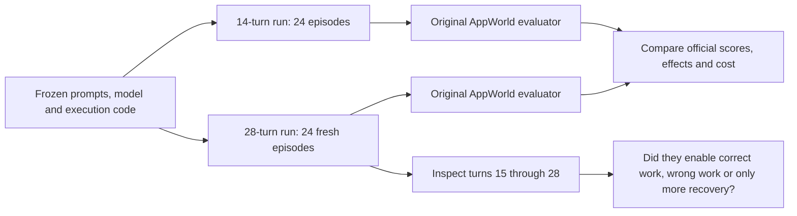
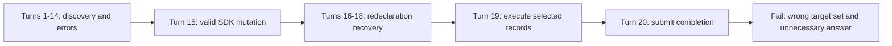

# AppWorld write tasks: 14 versus 28 turns

This experiment changes the agent's maximum turn count from 14 to 28. The tasks,
four methods, GPT-5.4 nano model, low reasoning setting, system prompts,
execution code and other limits are unchanged. It follows the
[first write-action pilot](WRITE-PILOT.md), which showed that the integration
could mutate AppWorld correctly but the model did not reliably complete write
tasks.

**Baseline:** `sdk-nano-writes-v1` (14 turns). **New run:**
`sdk-nano-writes-28-v1` (28 turns). **Frozen plan:**
[WRITE-BUDGET-PLAN.md](WRITE-BUDGET-PLAN.md), commit `161200e`.
[Interactive comparison and trajectories](http://127.0.0.1:55251/index.html#traces).

All **24/24 new episodes scored without infrastructure errors**. Overall
official success was **2/24 at 14 turns → 6/24 at 28 turns**. Of the new
successes, **4 finished after turn 14**; **20/24 episodes** used at least one
additional turn.

| Method                | Official: 14 → 28 | Writes: 14 → 28 | Read: 14 → 28 | 28-run passes after turn 14 |
| --------------------- | ----------------- | --------------- | ------------- | --------------------------- |
| Raw Python            | 0/6 → 2/6         | 0/4 → 0/4       | 0/2 → 2/2     | 2                           |
| Static notes / Python | 0/6 → 0/6         | 0/4 → 0/4       | 0/2 → 0/2     | 0                           |
| Raw TS                | 0/6 → 2/6         | 0/4 → 1/4       | 0/2 → 1/2     | 2                           |
| Relate SDK / TS       | 2/6 → 2/6         | 0/4 → 0/4       | 2/2 → 2/2     | 0                           |

A larger budget helps agents reach execution and completion, but it does not
reliably correct target selection or answer submission. These are tiny samples:
four write cases and two read controls per method, with two variants of one
write family. They do not establish a general ranking.

| Method                | Correct write-state checks: 14 → 28 | Write episodes attempting mutations: 14 → 28 | Completed: 14 → 28 |
| --------------------- | ----------------------------------- | -------------------------------------------- | ------------------ |
| Raw Python            | 0/4 → 0/4                           | 1/4 → 4/4                                    | 0/6 → 6/6          |
| Static notes / Python | 0/4 → 3/4                           | 1/4 → 4/4                                    | 0/6 → 6/6          |
| Raw TS                | 0/4 → 1/4                           | 1/4 → 4/4                                    | 0/6 → 4/6          |
| Relate SDK / TS       | 1/4 → 0/4                           | 2/4 → 4/4                                    | 4/6 → 6/6          |

**Static notes achieved the requested write effects in 3/4 cases, but all three
failed answer submission.** This is a useful signal from the retained ablation:
semantic instructions can help with record selection, while completion remains a
separate failure. It does not establish that notes generally outperform a graph;
there are only four write cases per method.

Correct write-state checks are a diagnostic, not an adjusted success score.
Completion means the task was submitted, not that the evaluator accepted its
effects or answer.

| Method                | Mean turns: 14 → 28 | Mean seconds: 14 → 28 | Mean input tokens: 14 → 28 | Mean output tokens: 14 → 28 |
| --------------------- | ------------------- | --------------------- | -------------------------- | --------------------------- |
| Raw Python            | 14.0 → 19.0         | 22.7 → 32.0           | 54,741 → 97,584            | 1,549 → 2,439               |
| Static notes / Python | 14.0 → 20.5         | 21.6 → 31.5           | 57,121 → 109,025           | 1,322 → 2,261               |
| Raw TS                | 14.0 → 21.5         | 21.9 → 37.4           | 60,491 → 121,824           | 1,651 → 2,843               |
| Relate SDK / TS       | 11.0 → 14.0         | 21.0 → 29.2           | 51,467 → 80,287            | 1,713 → 2,318               |

Recorded episode time totals **523.0s (8.7 min) → 781.1s (13.0 min)**. Estimated
model cost totals **$0.1574 → $0.2385**. The calls actually made after turn 14
in the new run account for **$0.0763** of its cost. That is observed post-14
spending, not an exact causal cost difference, because the fresh trajectories
also differ before turn 15.

| Method                | Estimated cost: 14 → 28 | 28-run cost after turn 14 |
| --------------------- | ----------------------- | ------------------------- |
| Raw Python            | $0.0389 → $0.0583       | $0.0194                   |
| Static notes / Python | $0.0385 → $0.0629       | $0.0219                   |
| Raw TS                | $0.0415 → $0.0685       | $0.0280                   |
| Relate SDK / TS       | $0.0385 → $0.0488       | $0.0070                   |

Stopping reasons in the 28-turn run: `completed` 22, `step-budget` 2.

## The controlled change

| Parameter                      | Baseline                                           | New run                  |
| ------------------------------ | -------------------------------------------------- | ------------------------ |
| Turn limit                     | 14                                                 | 28                       |
| Training tasks                 | `afc0fce_1`, `afc0fce_2`, `d0b1f43_1`              | Same                     |
| Methods                        | Raw Python, static-notes Python, raw TS, Relate TS | Same                     |
| Repeats                        | Two per task/method                                | Same                     |
| Model                          | GPT-5.4 nano, low reasoning                        | Same                     |
| Prompts                        | Frozen write-pilot prompts                         | Byte-for-byte identical  |
| Execution source               | Six frozen files                                   | Identical SHA-256 hashes |
| SDK                            | Main realm fix `5a0af21` included                  | Same package source      |
| Output tokens/request          | 4,096                                              | Same                     |
| Generated tokens/episode       | 14,000                                             | Same                     |
| Visible output characters/turn | 14,000                                             | Same                     |
| Code timeout                   | 60 seconds                                         | Same                     |
| Estimated run-cost stop        | $2                                                 | Same                     |
| World seed                     | 100                                                | Same                     |
| Provider seed                  | None                                               | None                     |
| Per-turn completion reminders  | Off                                                | Off                      |

The three tasks are two variants of a write family and one existing read
control. The write variants ask for likes and comments on received payments from
a specified contact group in a recent date window. The read control asks for an
outgoing-payment aggregate. All are training instances; this is not a held-out
benchmark result or a measurement over every domain.

The host enforces the turn limit; it is not announced as a new allowance in the
model prompt.

The new run starts fresh worlds and model conversations. It does **not** resume
the old conversations at turn 15. The same task/method/repeat case can therefore
produce a different first 14 turns, both because there is no provider seed and
because canonical graph IDs are generated anew. A new pass completed before turn
15 cannot be directly credited to the larger limit. A pass after turn 14 uses
the additional opportunity, but this is still not a shared-prefix causal
experiment.

No model or harness changes were made during execution. No failures were
repaired or retried to improve the score. The existing generated-token limit
remained in place: this isolates the turn-limit setting, rather than doubling
every budget.



## What the metrics mean

The headline success count is always the original evaluator's task result. A
submitted completion is not necessarily a pass. A write episode can also pass
all world-state checks but fail its answer check; that remains an official
failure and is separately labeled in the explorer.

Mutation counts are original API requests, including attempted requests that may
fail. They are not automatically counts of successful effects. We reconstruct
which turn issued them by partitioning the original request log using the
recorded setup, acquisition and per-turn call counts. An assertion verifies that
these exhaust the log; this AppWorld version does not record the host's
completion polling as API requests.

We report the first mutation request, use of turns after 14, stopping reasons,
completion, model and execution time, replayed input tokens, generated output,
cached input, estimated cost and original evaluation checks. Input tokens
include history replay and cached input; output tokens include reasoning. Model
prices are the same frozen assumptions as the previous study, not invoice data.

Timing includes each episode's setup. SDK episodes still acquire the same fixed
music-plus-payments snapshot before the first model turn. They do not get a
special smaller snapshot for these tasks. Source mutations still call original
Venmo operations, read the transaction back, and refresh the existing SDK
observation. For the full action signatures and source/receipt limitations, see
[the write integration report](WRITE-PILOT.md#the-exact-new-sdk-surface).

## What happened in the additional turns

### Raw TypeScript passes with completion on turn 15

`sdk-nano-writes-28-v1/afc0fce_1__raw_ts__1` passed the complete write task. It
retrieved the contact group, collected all payment pages, filtered senders and
performed the likes and comments at turn 14. It then called
`await completeTask({status: 'success'})` without an answer at turn 15. All
original evaluator checks passed. The extra turn was used for submission, not
for more source mutations. This is one observed success, not a general
reliability claim about raw TS.

### A raw-API read succeeds after turn 14

`sdk-nano-writes-28-v1/d0b1f43_1__raw__0` passed at turn 21. After turn 14, it
inspected transaction documentation, collected the contact emails, paginated
outgoing transactions, calculated the aggregate and finally submitted it. This
trajectory demonstrates that the additional opportunity can matter for the raw
API condition. Its matched 14-turn case failed, but the new trajectory is not a
continuation of that old case.

### Extra turns recover the SDK call shape, then execute the wrong selection

`sdk-nano-writes-28-v1/afc0fce_1__sdk__0` initially confused an awaited query
page with an iterable query handle. It recovered, traversed received
transactions and filtered by date. It omitted the required sender contact-group
constraint. It also tried this malformed action shape:

```ts
// Wrong: transaction belongs inside input.
await relate.actions.likeTransaction({ transaction: id, idempotencyKey: key });

// Correct existing public SDK call:
await relate.actions.likeTransaction({
  input: { transaction: id },
  idempotencyKey: key,
});
```

The action descriptions and generic prompt syntax were available. A valid action
finally executed at turn 15. After further redeclaration errors, the agent
performed the broader loop at turn 19 and submitted at turn 20. More time
resolved the execution obstacle; it did not repair the missing task constraint.
The task failed the target-set checks and the answer check.



### Static notes reach correct effects, but not correct completion

`sdk-nano-writes-28-v1/afc0fce_1__static__0` used the extra turns to retrieve
the contact group, paginate payments and apply both mutations. It first issued
those mutations at turn 23. Every world-state check passed. At turn 25 it
submitted a count, so the original evaluator still marked it failed. The shared
system prompt already said to omit an answer when none was required; the extra
time did not ensure compliance.

### Early completion with the wrong date window

`sdk-nano-writes-28-v1/afc0fce_1__sdk__1` finished at turn 11. This time it
correctly applied the contact-group and incoming-direction constraints, but
computed the start by subtracting four 24-hour periods from the current time of
day. That excludes most of the earliest calendar day from a five-day window that
includes today. It updated only part of the required set and submitted an
unnecessary count. Raising the maximum turn count cannot help this trajectory
once it chooses to stop; the remaining allowance is unused.

### Naming a variable does not apply the intended constraint

`sdk-nano-writes-28-v1/afc0fce_2__sdk__1` named its selection `inRangeFriends`,
but the filter checked only the date window, receiver and sender inequality. It
never tested membership in the friend contact group. In simplified form:

```ts
const inRangeFriends = transactions.filter(
  (t) => inWindow(t) && t.receiver === me && t.sender !== me,
); // No friend-membership predicate.
```

It then executed the actions and stopped at turn 12. The graph had the contact
relationship data, but the model did not use it in the selection. An interface
can expose the right information without ensuring that an agent applies every
constraint in the user's request.

### A successful submission can still conceal wrong effects

`sdk-nano-writes-28-v1/afc0fce_1__raw__0` finished at turn 19. It eventually
submitted without an answer, so the answer check passed. But it acted on
incoming payments without applying the requested contact-group constraint, and
failed the target-set checks. Fixing answer formatting alone would not rescue
this episode.

## Implications and next decision

**Use 28 turns for the next diagnostic comparison, but do not treat more turns
as a reliability fix.** The raw-interface conditions demonstrably use extra
turns to finish work. Keeping the limit at 14 can obscure whether they can solve
a task at all. The larger budget also makes wrong mutations possible where the
shorter run stopped before acting.

The next narrow prompt experiment should add a concrete **write-only completion
example uniformly across all four methods**. The existing rule already says to
omit unnecessary answers; show `apis.supervisor.complete_task()` in Python and
`await completeTask()` in both Node environments alongside the answer-bearing
form. Keep completion outside the SDK, use the same 28-turn subset and preserve
this run unchanged. This may address answer-only failures, but will not fix
wrong records or wrong date windows.

After that, test one generic constraint-verification instruction separately:
before mutating, check the direction, contact group, date boundaries and
completeness of the selected collection against the request. Do not silently add
a task-solving helper or make the SDK enforce benchmark-specific selection
rules. This would be a prompt ablation shared across methods, not a claim that
the model will obey it.

For interface work, the traces support two concrete questions for later
agreement:

- Can the REPL make recovery from partially executed cells easier without
  changing one Node arm alone? Persistent `let`/`const` declarations repeatedly
  cost turns. Any experiment here should use the same behavior for raw TS and
  SDK TS.
- Should SDK action validation identify the missing argument path rather than
  returning only `ActionError: invalid`? For example, the malformed top-level
  `transaction` call could identify missing `input.transaction`. That is a
  Relate change and requires agreement before implementation; it was not made
  here.

The recommendation is to keep the current subset and nano while addressing these
distinct failure modes. Do not expand to all domains on the strength of a higher
completion count. The default harness option remains 14; this experiment
selected 28 explicitly and does not silently change future runs.

## What changed in this increment

Only research analysis, plans, reports and the explorer changed. The SDK, action
implementations, acquisition, prompts, model-call code and REPL are unchanged.
`--steps 28` selects an existing harness option.

- `budget_compare.py` verifies the allowed configuration differences and
  produces paired-case diagnostics, including first mutation turn and post-14
  usage.
- `sdk_summarize.py` labels the new study separately.
- The explorer preserves both experiments, adds a compact 14-versus-28 table and
  a button to jump to the same task/method/repeat in the other run.
- Turns beyond the old limit are explicitly labeled in the turn viewer.
- Public JSON contains sanitized measurements; raw task data, full traces and
  evaluator details remain local or in the original encrypted AppWorld format.

The matched-case button is a navigation aid, not a claim of identical model
sampling. The original 14-turn report and its scores remain unchanged.

## Reproduce

```sh
# Uses the existing execution code. A new run name is required.
dev/research/appworld/.venv/bin/python dev/research/appworld/sdk_runner.py \
  --run YOUR_FRESH_RUN_NAME \
  --tasks afc0fce_1 afc0fce_2 d0b1f43_1 \
  --conditions raw static raw_ts sdk --repeats 2 --steps 28 \
  --credentials /path/to/provider.env --max-cost-usd 2

python3 dev/research/appworld/budget_compare.py \
  --baseline sdk-nano-writes-v1 --candidate sdk-nano-writes-28-v1 \
  --output dev/research/appworld/evidence/write-budget-comparison.json
```

[28-turn measurements](evidence/write-budget.json) ·
[paired comparison](evidence/write-budget-comparison.json) ·
[write diagnostics](evidence/write-budget-audit.json) ·
[validation](evidence/write-budget-validation.json).

## Every matched case

The baseline prefix is `sdk-nano-writes-v1/`; the candidate prefix is
`sdk-nano-writes-28-v1/`. “First write” means first original mutation request in
the candidate, not guaranteed successful effects.

| Trajectory suffix      | Official: 14 → 28 | Turns: 14 → 28 | 28-run seconds | First write turn | 28-run input / output tokens |
| ---------------------- | ----------------- | -------------- | -------------- | ---------------- | ---------------------------- |
| `afc0fce_1__raw__0`    | fail → fail       | 14 → 19        | 35.22          | 17               | 103,610 / 2,489              |
| `afc0fce_1__raw__1`    | fail → fail       | 14 → 16        | 27.37          | 15               | 73,727 / 1,965               |
| `afc0fce_1__raw_ts__0` | fail → fail       | 14 → 20        | 43.40          | 18               | 109,120 / 3,715              |
| `afc0fce_1__raw_ts__1` | fail → pass       | 14 → 15        | 22.93          | 14               | 71,701 / 1,872               |
| `afc0fce_1__sdk__0`    | fail → fail       | 12 → 20        | 39.57          | 15               | 142,206 / 3,315              |
| `afc0fce_1__sdk__1`    | fail → fail       | 14 → 11        | 20.18          | 9                | 56,003 / 1,704               |
| `afc0fce_1__static__0` | fail → fail       | 14 → 25        | 36.89          | 23               | 139,692 / 2,343              |
| `afc0fce_1__static__1` | fail → fail       | 14 → 17        | 27.81          | 16               | 82,980 / 2,080               |
| `afc0fce_2__raw__0`    | fail → fail       | 14 → 19        | 30.52          | 13               | 116,603 / 2,092              |
| `afc0fce_2__raw__1`    | fail → fail       | 14 → 19        | 44.48          | 16               | 113,566 / 4,546              |
| `afc0fce_2__raw_ts__0` | fail → fail       | 14 → 28        | 48.74          | 28               | 202,771 / 3,660              |
| `afc0fce_2__raw_ts__1` | fail → fail       | 14 → 28        | 47.45          | 28               | 149,655 / 3,813              |
| `afc0fce_2__sdk__0`    | fail → fail       | 13 → 18        | 41.14          | 17               | 130,903 / 3,749              |
| `afc0fce_2__sdk__1`    | fail → fail       | 14 → 12        | 24.75          | 11               | 56,116 / 2,243               |
| `afc0fce_2__static__0` | fail → fail       | 14 → 16        | 23.89          | 14               | 74,670 / 1,716               |
| `afc0fce_2__static__1` | fail → fail       | 14 → 27        | 38.16          | 22               | 141,561 / 2,620              |
| `d0b1f43_1__raw__0`    | fail → pass       | 14 → 21        | 28.66          | —                | 101,655 / 1,746              |
| `d0b1f43_1__raw__1`    | fail → pass       | 14 → 20        | 26.04          | —                | 76,341 / 1,798               |
| `d0b1f43_1__raw_ts__0` | fail → fail       | 14 → 17        | 29.64          | —                | 91,618 / 2,013               |
| `d0b1f43_1__raw_ts__1` | fail → pass       | 14 → 21        | 32.24          | —                | 106,077 / 1,984              |
| `d0b1f43_1__sdk__0`    | pass → pass       | 7 → 9          | 24.01          | —                | 39,048 / 1,270               |
| `d0b1f43_1__sdk__1`    | pass → pass       | 6 → 14         | 25.81          | —                | 57,445 / 1,629               |
| `d0b1f43_1__static__0` | fail → fail       | 14 → 19        | 30.51          | —                | 123,835 / 2,226              |
| `d0b1f43_1__static__1` | fail → fail       | 14 → 19        | 31.70          | —                | 91,413 / 2,582               |

## Verification

Both runs have complete 24-case coverage and no infrastructure failures.
Execution-file hashes, package-source identity, exact prompts, completion
instructions appearing once, configuration differences, per-turn request-log
partitioning, and token/time/cost sums were checked. The cumulative encrypted
archive was unpacked and compared byte-for-byte with the originals. New public
artifacts and the local explorer were checked for credential leakage; provider
continuation payloads are omitted from the explorer.

Focused Python lint/formatting and HTML JavaScript syntax checks passed. Browser
verification covers the budget comparison, all 24 new trajectories, matched-case
navigation, outcome filters, turn 15 and frozen source inspection. No execution
or package code changed, so the preceding pilot's integration tests were not
rerun; no new repository-wide `pnpm check` result is claimed.
