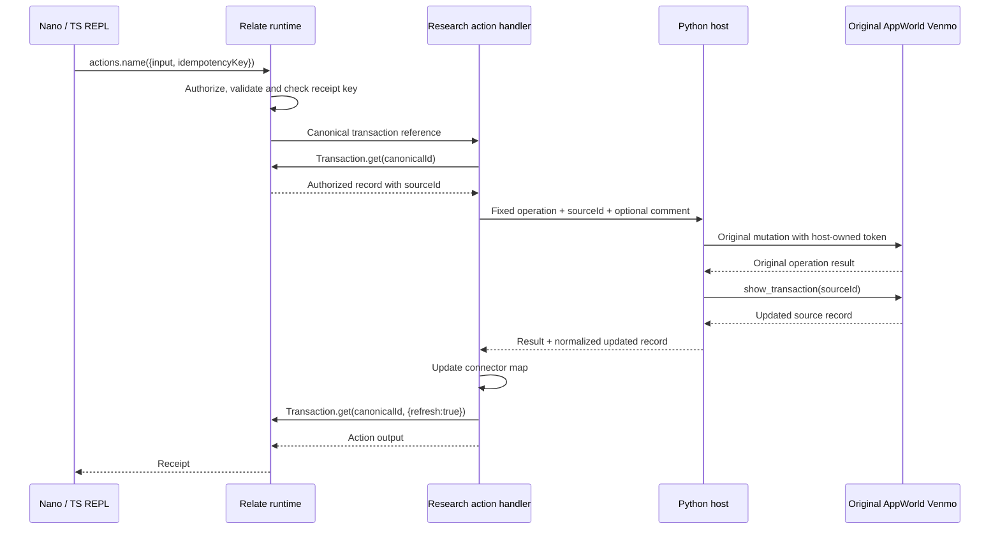
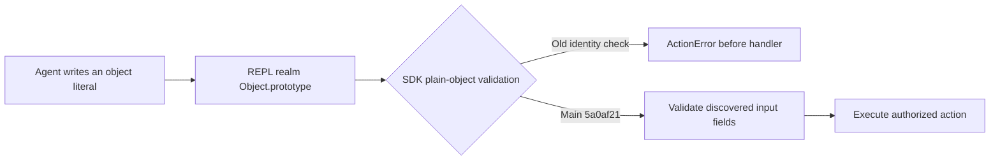
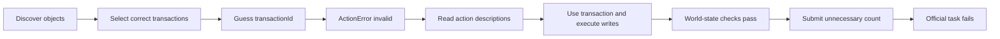

# AppWorld: first write-action pilot

This increment asks whether the agent can use the real Relate SDK to change
application state, rather than only retrieve answers. All four conditions
remain: raw Python, static-notes Python, raw TypeScript, and Relate TypeScript.
The intended primary comparison is still raw TS versus Relate.

**Run:** `sdk-nano-writes-v1`. **Implementation:** `278ea26`, including main's
`5a0af21` cross-realm fix. **Model:** GPT-5.4 nano, low reasoning.
[Local trajectory explorer](http://127.0.0.1:55251/index.html#traces).

All **24/24 episodes scored without infrastructure errors**. This is a small
development pilot, not a leaderboard result.

| Condition             | Official success | Write tasks | Read control | Mean turns | Mean episode time | Total model cost |
| --------------------- | ---------------- | ----------- | ------------ | ---------- | ----------------- | ---------------- |
| Raw Python            | 0/6              | 0/4         | 0/2          | 14.0       | 22.7s             | $0.0389          |
| Static notes / Python | 0/6              | 0/4         | 0/2          | 14.0       | 21.6s             | $0.0385          |
| Raw TS                | 0/6              | 0/4         | 0/2          | 14.0       | 21.9s             | $0.0415          |
| Relate SDK / TS       | 2/6              | 0/4         | 2/2          | 11.0       | 21.0s             | $0.0385          |

The sum of recorded episode wall times is **523.0s (8.7 minutes)**. Estimated
model cost is **$0.1574**; it excludes machine costs and uses the frozen price
assumptions, not billing data. Setup, acquisition and model timings are retained
individually.

**The action integration works, but reliable write-task completion is not
demonstrated.** One SDK write episode passed all eight world-state checks and
failed only its unnecessary answer submission. Another executed mutations on the
wrong contact group. Both remaining SDK write episodes exhausted the turn budget
before any mutation. Correct source effects do not convert an official failure
into a success.

| Condition             | Mean input tokens | Mean cached input | Mean output tokens | Mean total source calls | Mean acquisition calls | Mean acquisition time |
| --------------------- | ----------------- | ----------------- | ------------------ | ----------------------- | ---------------------- | --------------------- |
| Raw Python            | 54,741            | 35,520            | 1,549              | 36.8                    | 0.0                    | 0.000s                |
| Static notes / Python | 57,121            | 36,992            | 1,322              | 19.5                    | 0.0                    | 0.000s                |
| Raw TS                | 60,491            | 40,256            | 1,651              | 18.5                    | 0.0                    | 0.000s                |
| Relate SDK / TS       | 51,467            | 33,472            | 1,713              | 88.7                    | 55.3                   | 0.399s                |

Input tokens include replayed history; cached tokens are a subset. Output
includes reasoning. Source calls include common authentication, SDK acquisition,
original agent API requests and task completion, but exclude host completion
polling. SDK graph-map fetches are separate instrumentation. Each successful SDK
source mutation adds an original API readback.

| Condition             | Write episodes with any mutation request | Like requests | Comment requests | Literal-only status cells |
| --------------------- | ---------------------------------------- | ------------- | ---------------- | ------------------------- |
| Raw Python            | 1/4                                      | 25            | 25               | 23                        |
| Static notes / Python | 1/4                                      | 20            | 20               | 24                        |
| Raw TS                | 1/4                                      | 20            | 20               | 17                        |
| Relate SDK / TS       | 2/4                                      | 43            | 43               | 10                        |

Mutation requests are attempts, not successful-effect counts. The status-cell
indicator counts a cell containing only one literal `print(...)` or
`console.log(...)`; it does not label every unproductive cell.

## What was frozen before execution

Three training instances, four conditions and two repeats: 24 episodes. The new
write instances are `afc0fce_1` and `afc0fce_2`: find incoming payments from a
specified contact group within a recent date window, add the requested comment,
and like those payments. They are variants of one task family, not independent
families. `d0b1f43_1`, an existing outgoing-payment aggregation, is the read
control.

No test-normal tasks or reference solutions were used to author the integration.
The original AppWorld evaluator runs after each episode. There is no alternate
success scorer, automatic retry to improve the score, prompt change during the
run, or promotion to mini. Two repeats are retained individually; this is not a
best-of-two score.

| Setting                            | Value                            |
| ---------------------------------- | -------------------------------- |
| Model / reasoning                  | GPT-5.4 nano / low               |
| Maximum turns                      | 14                               |
| Output tokens per model request    | 4,096                            |
| Generated-token budget per episode | 14,000                           |
| Visible output per turn            | 14,000 characters                |
| Code execution timeout             | 60 seconds                       |
| World random seed                  | 100                              |
| Provider seed                      | None                             |
| Estimated model-cost stop          | $2 for the run                   |
| Per-turn completion reminders      | Disabled                         |
| Condition order                    | Rotated by task index and repeat |

Each episode starts with a fresh AppWorld world and a fresh agent context. The
host logs into Spotify, phone and Venmo for every arm. SDK episodes acquire the
same music-plus-payments union as before, even for payment-only tasks. This is
intentionally unchanged; it includes preparation cost that a narrower production
setup might avoid.

## The exact new SDK surface

The existing five object types, references and traversals remain. Transaction
adds `commentCount`, mapped from the original API's `comment_count`. Existing
`likeCount` remains a total count, not a flag saying whether the current user
liked the transaction.

```ts
// Discovery: actual public consumer operations
console.log(await relate.describe());
console.log(await relate.actions.commentOnTransaction.describe());
console.log(await relate.actions.likeTransaction.describe());

// Illustrative calls. transactionId is a canonical Relate ID.
const receipt = await relate.actions.commentOnTransaction({
  input: { transaction: transactionId, comment: 'Example text' },
  idempotencyKey: 'comment-payment-1',
});
console.log(receipt.output); // { message: string, commentId: string }

console.log(
  await relate.actions.likeTransaction({
    input: { transaction: transactionId },
    idempotencyKey: 'like-payment-1',
  }),
); // Action receipt; output: { message: string }
```

These are application-authored actions using `defineAction` and
`implementAction` from `relate`, executed by `createRuntime` from
`@relate/node`. They are not a new `research()` wrapper. The agent gets the
actual consumer. It does not get the host callback, source credentials, generic
`apis` object or original source APIs.

Both actions explicitly grant execution to this experiment's authenticated actor
role. Their `transaction` inputs use `referenceInput(Transaction)`. The handler
reads that canonical transaction through its authorized SDK context and uses its
`sourceId` to address Venmo. The host additionally restricts writes to
transaction source IDs acquired for the episode.

The source bridge permits only:

| SDK action             | Original AppWorld operation        | Result returned through the receipt |
| ---------------------- | ---------------------------------- | ----------------------------------- |
| `likeTransaction`      | `venmo.like_transaction`           | `message`                           |
| `commentOnTransaction` | `venmo.create_transaction_comment` | `message`, string `commentId`       |

Each successful mutation is followed by `venmo.show_transaction`. The returned
record updates the research connector's map. The handler calls
`objects.Transaction.get(id, { refresh: true })` to refresh the observation in
the same runtime before returning. It does not recreate the graph or discard
receipts.



Python remains the benchmark owner because AppWorld runs there. The model's SDK
code runs in TypeScript, transpiled to JavaScript and executed in a persistent
Node REPL. The Python bridge is an implementation detail of these source
actions, not a second data interface offered to the SDK agent.

## Prompt and discovery differences

The raw Python, static-notes Python and raw TS prompts are unchanged from the
preceding uniform-prompt run. The SDK prompt adds generic action discovery and
invocation syntax because action discovery describes inputs and outputs but does
not provide the invocation signature. It supplies no Venmo action names, field
names, contact groups or task-solving recipe.

```ts
console.log(await relate.actions[apiName].describe());
await relate.actions[apiName]({
  input: {/* discovered fields */},
  idempotencyKey: 'unique-operation-key',
});
```

The shared completion instruction already says: **if no answer is required, omit
it**. That instruction appears once in every system prompt. Nothing about answer
shape or task completion was added to the Relate SDK. The experiment preserves
the generic completion examples from the previous harness, including
`completeTask({answer: value})`; a future prompt test could make the no-answer
example equally explicit across all arms, but this run does not do so.

## Why the main fix mattered

The first preflight failed before any write because the SDK compared an input's
prototype by identity with the host JavaScript context's `Object.prototype`.
Objects written inside the REPL have a different realm's prototype. Main commit
`5a0af21` replaces that test with the shared `isPlainObject` helper across
actions, read options, query filters and source records.

We merged main and rebuilt the packages. The research regression now executes
foreign-realm, host-realm and host-cloned inputs successfully. No research
adapter clones or rewrites action arguments to work around validation. New
implementation work in this increment stays under `dev/research/appworld`; the
SDK fix was supplied on main by the owner.



## Reliability guarantees and limits

The tests verify successful same-key replay does not call the source twice
within one live runtime. Reusing the key with different input is rejected.
Subsequent SDK get and query reads see the changed counts. A real AppWorld smoke
verifies source mutation and credential isolation; the existing
completion-persistence smoke verifies that the original evaluator receives
submitted completion state.

This is **not durable exactly-once execution across AppWorld and Relate**.
Venmo's external mutation and Relate's receipt cannot be committed in one
transaction. A source mutation could succeed and its readback or the later
receipt commit could fail. The research host distinguishes a known successful
write followed by readback failure internally, but this pilot does not expose a
declared domain error contract or a reconciliation API. Unexpected handler
failures can therefore appear to the agent only as `ActionError: internal`. Do
not infer rollback from that error or promise that a fresh retry cannot
duplicate a comment.

Other deliberate limits:

- Only own acquired transactions support these two writes. No payment creation,
  money transfer, deletion, payment requests or social-feed expansion.
- The graph updates after its own successful actions; it does not synchronize
  unrelated concurrent source changes.
- Comment IDs are returned as source identifiers. There is no Comment object,
  comment traversal or comment-history query in this slice.
- `likeCount` and `commentCount` cannot establish that a particular user already
  performed an operation. They are aggregate source counts.
- The role remains named `reader` from the original fixture, with explicit
  execution grants for the two actions. The name is not a runtime restriction.
- Original API request logs count attempts, including requests that may fail.
  They do not by themselves prove committed source effects.

## Trajectories and interpretation

### Correct writes, failed completion

`sdk-nano-writes-v1/afc0fce_1__sdk__0` completed in 12 turns. It discovered
Transaction and Person, collected the correct contact group and transaction set,
then guessed `transactionId` as the action input. The SDK rejected the input.
After reading both action descriptions, it retried using `transaction` and
successfully performed the mutations. All eight world-state checks passed. The
remaining answer check failed because the agent submitted a count instead of
omitting the answer.

This is a discovery-recovery example, not a passing task. The one-time shared
prompt already covered the required completion behavior; nano did not follow it.
Simply saying “we need to tell the model” misses that the instruction was
present.



### Working actions, wrong transaction selection

`sdk-nano-writes-v1/afc0fce_2__sdk__0` demonstrates a more consequential
failure. It tried a date-range object in a query filter, received a helpful
error that the field expects a string, and moved date filtering into code. It
then used `Person.traverse.receivedTransactions` to retrieve incoming
transactions in the window. But it omitted the requested sender contact-group
filter before applying both actions. The calls worked; the selected records were
wrong. It also submitted an unnecessary count. Fixing completion alone would not
make this episode pass.

The corresponding raw TS episode, `afc0fce_2__raw_ts__0`, also omitted the group
filter and mutated only the first API page before trying to collect the
remaining pages. It reached the turn budget without completing. This comparison
illustrates different execution paths to task failure, not an intrinsic
guarantee that either interface prevents unwanted changes.

### Turn budget lost to REPL recovery

Both second-repeat SDK write trajectories (`afc0fce_1__sdk__1` and
`afc0fce_2__sdk__1`) exhausted 14 turns without any source mutation. One awaited
a query, received its first page, and then tried to iterate that page as the
query handle. Recovery triggered repeated top-level variable redeclarations. The
other also repeated declarations after preparing the intended selection. The
model was already told that bindings persist. These are execution and recovery
failures, not evidence that the action bridge could not perform a valid call.

### Read control

`sdk-nano-writes-v1/d0b1f43_1__sdk__0` passed in seven turns without performing
source writes. It is a useful regression observation, not a causal comparison to
an older run: this experiment uses newer main and a prompt containing generic
action instructions. The older results remain preserved separately.

## What changed in the research code

| File                           | Change                                                                                                                                |
| ------------------------------ | ------------------------------------------------------------------------------------------------------------------------------------- |
| `sdk-graph.mjs`                | Two real SDK actions, implementations, `commentCount`, updated source map and explicit observation refresh                            |
| `sdk_runner.py`                | Host-only credentials for SDK source handlers, fixed-operation write RPC, acquired-ID restriction, original API mutation and readback |
| `sdk-repl.mjs`                 | Hidden write callback and response routing while a cell is awaiting; agent still gets only the consumer                               |
| `acquire.py`                   | Shared transaction normalization including comment count                                                                              |
| `prompts.py`                   | Generic SDK action discovery, invocation and idempotency-key syntax                                                                   |
| `test/sdk-graph.test.mjs`      | Read-after-write, receipt replay, changed-input key conflict and invalid reference checks                                             |
| `test/action_realm_repro.mjs`  | Regression proving ordinary action objects from another realm work                                                                    |
| `test/sdk_write_smoke.py`      | Original Venmo effects, refreshed SDK values, one comment despite replay, no agent credentials                                        |
| `write_audit.py`               | Sanitized write-attempt counts and original-evaluator failure categories                                                              |
| `explorer.py`, `explorer.html` | New run, full IDs, original request logs and a filter for correct writes with failed answer submission                                |

The compact-evidence behavior is inherited from current main and was not changed
in this increment. The new action code does not inject completion feedback or
special-case these tasks.

## Next decisions

1. **Review the incorrect target selection before broadening domains.** The
   write API works, but acting on the wrong contact group is materially
   different from merely returning a wrong total. Keep nano and this small
   subset while distinguishing target selection, action execution and completion
   failures.
2. **Test a narrow, uniform completion clarification.** Retain the existing
   “omit the answer” rule and add equally explicit write-only examples to all
   four environments: `apis.supervisor.complete_task()` for Python and
   `await completeTask()` for Node. Keep this in the system prompt, not Relate.
   Use a new run name, identical budgets and paired task coverage; do not
   rescore the present failures as successes or add per-turn evaluator feedback.
3. **Measure budget sensitivity separately.** Repeat this subset with the same
   frozen prompts and 28 turns for every arm. That tests whether discovery and
   REPL recovery mainly need more steps. Report extra time and tokens, including
   episodes that still fail. Do not combine this change with prompt tuning if
   the goal is to identify which change helped.
4. **Decide whether selection-before-mutation guidance is worth an ablation.** A
   short generic rule to collect and verify all requested constraints before
   changing records can be applied uniformly. Do not add a task-specific helper
   that hides the failed contact-group reasoning from the benchmark.
5. **Improve research action failure reporting before adding harder writes.**
   Declare source-rejection and uncertain-outcome errors, then fault-inject
   readback failure after a successful write. Document when retrying is safe. Do
   not treat local receipt idempotency as an external transaction guarantee.
6. **Then add one independent write family.** For example, playlist membership
   changes would exercise create/remove effects and relationship freshness,
   which incrementing counts on an existing transaction does not test. Retain
   all four conditions during development; raw TS versus SDK can remain the
   final main comparison. No flat-array arm is required for this next step.

These are proposals. No additional prompt tuning, source-error redesign or
playlist write implementation was applied during this frozen pilot.

## Reproduce and inspect

```sh
pnpm exec tsc -b packages/protocol packages/relate packages/runtime packages/node
node --test dev/research/appworld/test/*.test.mjs
node dev/research/appworld/test/action_realm_repro.mjs
dev/research/appworld/.venv/bin/python -m unittest discover \
  -s dev/research/appworld/test -p 'test_*.py'
dev/research/appworld/.venv/bin/python dev/research/appworld/test/sdk_write_smoke.py

# A fresh name is required; runs are not overwritten.
dev/research/appworld/.venv/bin/python dev/research/appworld/sdk_runner.py \
  --run YOUR_FRESH_RUN_NAME \
  --tasks afc0fce_1 afc0fce_2 d0b1f43_1 \
  --conditions raw static raw_ts sdk --repeats 2 \
  --credentials /path/to/provider.env --max-cost-usd 2
```

Public measurements: [write-pilot.json](evidence/write-pilot.json). Diagnostics:
[write-pilot-audit.json](evidence/write-pilot-audit.json). Validation:
[write-pilot-validation.json](evidence/write-pilot-validation.json). Protected
instructions, records, evaluator details and full trajectories remain in ignored
local artifacts and the AppWorld-format encrypted trajectory bundle. The local
HTML report contains redacted protected benchmark data and is not a public
publication artifact. Prior studies remain separate in the explorer.

## Every recorded episode

Prefix every ID below with `sdk-nano-writes-v1/` in the explorer search.

| Trajectory suffix      | Official | Turns | Seconds | Input tokens | Output tokens | Like / comment requests |
| ---------------------- | -------- | ----- | ------- | ------------ | ------------- | ----------------------- |
| `afc0fce_1__raw__0`    | fail     | 14    | 22.16   | 46,682       | 925           | 0 / 0                   |
| `afc0fce_1__raw__1`    | fail     | 14    | 17.76   | 41,196       | 867           | 0 / 0                   |
| `afc0fce_1__raw_ts__0` | fail     | 14    | 22.35   | 65,655       | 1,841         | 0 / 0                   |
| `afc0fce_1__raw_ts__1` | fail     | 14    | 19.48   | 58,803       | 1,230         | 0 / 0                   |
| `afc0fce_1__sdk__0`    | fail     | 12    | 21.84   | 52,489       | 1,881         | 9 / 9                   |
| `afc0fce_1__sdk__1`    | fail     | 14    | 25.74   | 66,163       | 2,109         | 0 / 0                   |
| `afc0fce_1__static__0` | fail     | 14    | 25.27   | 52,532       | 1,803         | 0 / 0                   |
| `afc0fce_1__static__1` | fail     | 14    | 24.19   | 64,657       | 1,770         | 20 / 20                 |
| `afc0fce_2__raw__0`    | fail     | 14    | 20.77   | 49,967       | 1,506         | 0 / 0                   |
| `afc0fce_2__raw__1`    | fail     | 14    | 31.79   | 71,528       | 2,639         | 25 / 25                 |
| `afc0fce_2__raw_ts__0` | fail     | 14    | 25.05   | 71,969       | 1,916         | 20 / 20                 |
| `afc0fce_2__raw_ts__1` | fail     | 14    | 21.75   | 61,918       | 1,567         | 0 / 0                   |
| `afc0fce_2__sdk__0`    | fail     | 13    | 24.25   | 67,246       | 2,025         | 34 / 34                 |
| `afc0fce_2__sdk__1`    | fail     | 14    | 29.58   | 71,008       | 2,352         | 0 / 0                   |
| `afc0fce_2__static__0` | fail     | 14    | 22.27   | 62,465       | 1,499         | 0 / 0                   |
| `afc0fce_2__static__1` | fail     | 14    | 21.92   | 45,769       | 940           | 0 / 0                   |
| `d0b1f43_1__raw__0`    | fail     | 14    | 22.43   | 59,925       | 1,621         | 0 / 0                   |
| `d0b1f43_1__raw__1`    | fail     | 14    | 21.26   | 59,148       | 1,737         | 0 / 0                   |
| `d0b1f43_1__raw_ts__0` | fail     | 14    | 20.00   | 51,316       | 1,323         | 0 / 0                   |
| `d0b1f43_1__raw_ts__1` | fail     | 14    | 22.49   | 53,285       | 2,031         | 0 / 0                   |
| `d0b1f43_1__sdk__0`    | pass     | 7     | 12.63   | 22,314       | 867           | 0 / 0                   |
| `d0b1f43_1__sdk__1`    | pass     | 6     | 12.21   | 29,582       | 1,046         | 0 / 0                   |
| `d0b1f43_1__static__0` | fail     | 14    | 16.16   | 52,207       | 862           | 0 / 0                   |
| `d0b1f43_1__static__1` | fail     | 14    | 19.65   | 65,096       | 1,061         | 0 / 0                   |

## Verification performed here

Package rebuild; 17 Python research tests; 10 Node research tests; cross-realm
action regression; real AppWorld write/readback/replay smoke; completion
persistence against the original evaluator; package boundary check; focused
Python lint and formatting; HTML JavaScript syntax; and frozen source, prompts,
metric totals and encrypted-archive integrity. Browser verification covers the
updated experiment, outcome filter, trajectory IDs, metrics and frozen source
view. The full repository-wide `pnpm check` was not rerun here; the owner
reported it passing on the merged realm fix, including Postgres integration.
